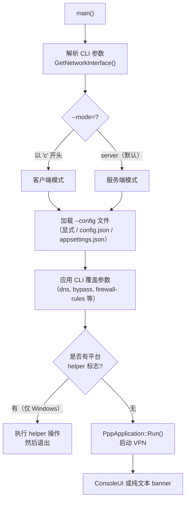
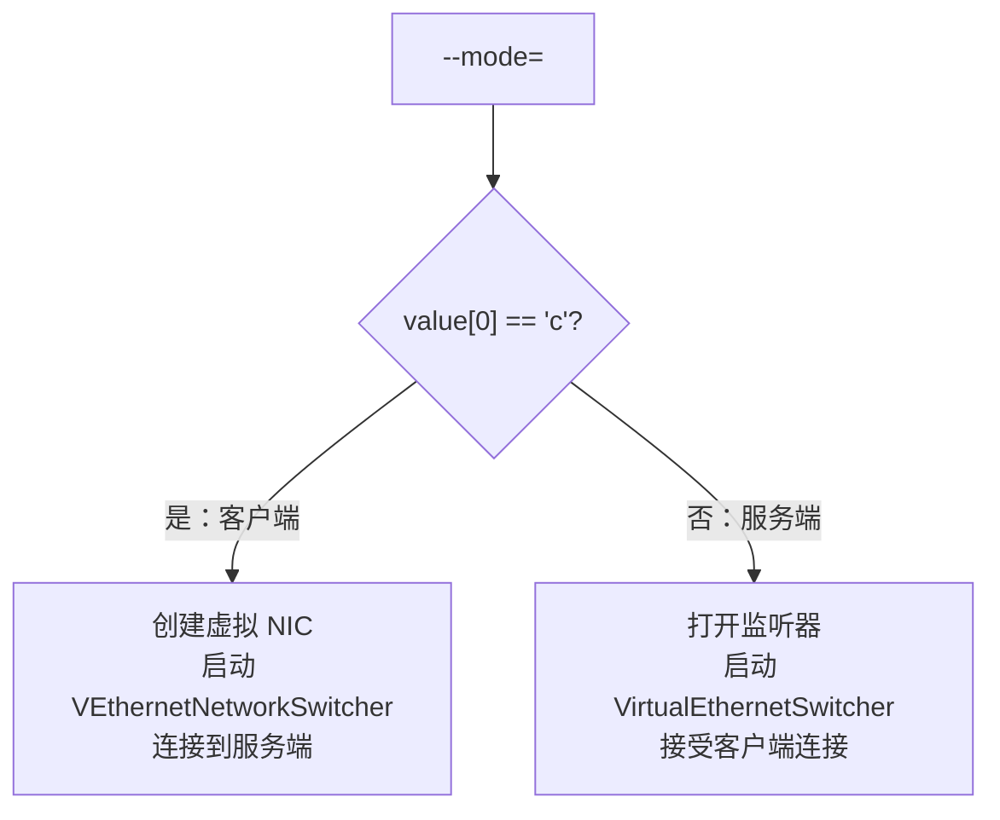

# 命令行参考

[English Version](CLI_REFERENCE.md)

## 定位

本文解释 `ppp` 真实的命令行，而不是只复述帮助输出。CLI 是启动期整形层，不是全部
配置模型。大多数行为调优在 `appsettings.json` 中完成；CLI 标志是在配置文件被完整
解析之前应用的覆盖参数和平台 helper 操作。

源码锚点：

- `main.cpp::PrintHelpInformation()` — 帮助文本生成
- `main.cpp::GetNetworkInterface()` — CLI 解析和 `NetworkInterface` 填充
- `main.cpp::IsModeClientOrServer()` — 模式检测

---

## 高层启动流程



---

## CLI 参数分组

CLI 大致分为：

1. 角色选择
2. 配置文件
3. 运行时整形
4. 客户端网络整形
5. 路由与 DNS 输入
6. 服务端策略输入
7. 平台 helper 命令（仅 Windows）
8. 工具命令

---

## 角色选择

### `--mode=[client|server]`

- **默认：** `server`
- **别名：** `--m`、`-mode`、`-m`
- 只要值以 `c` 开头（不区分大小写），就进入客户端模式。

这个参数决定整个启动分支：

- **客户端模式** 创建/使用虚拟网卡路径（`VEthernetNetworkSwitcher`、
  `VEthernetExchanger`、虚拟 TUN/TAP NIC）
- **服务端模式** 打开监听器和 server switcher 路径（`VirtualEthernetSwitcher`、
  `VirtualEthernetExchanger`）



**示例：**

```bash
ppp --mode=server --config=./server.json
ppp --mode=client --config=./client.json
ppp -m=client -c=./client.json
```

---

## 配置文件

### `--config=<path>`

别名：`-c`、`--c`、`-config`、`--config`

未指定时的查找顺序：

1. 命令行显式路径（如果已提供）
2. `./config.json`
3. `./appsettings.json`

生产环境建议始终显式指定路径，避免意外从工作目录加载到错误配置文件。

**示例：**

```bash
ppp --mode=server --config=/etc/ppp/server.json
ppp --mode=client -c=/home/user/.config/client.json
```

---

## 运行时整形

### `--rt=[yes|no]`

进程级 real-time 调度偏好。`yes` 时进程尝试提升调度优先级，适用于低延迟服务器。

### `--dns=<ip-list>`

覆盖本次运行的本地 DNS 列表。接受逗号或分号分隔的 IP 地址列表。写入
`NetworkInterface::DnsAddresses`，不会替代 DNS rules 或服务端 DNS 逻辑。

**示例：**

```bash
ppp --mode=client -c=./client.json --dns=8.8.8.8,1.1.1.1
```

### `--tun-flash=[yes|no]`

早期设置默认 flash/TOS 倾向。控制虚拟网卡是否为数据包打上加速转发 DSCP 位。

### `--auto-restart=<seconds>`

进程级自动重启计时器。指定秒数到期后，进程通过 `ShutdownApplication(true)` 发起
优雅重启。`0` 关闭定时器。

**示例：**

```bash
ppp --mode=client -c=./client.json --auto-restart=3600
```

### `--link-restart=<count>`

VPN 链路重连次数超过 `count` 时触发进程重启，用于检测陈旧状态并强制清洁重启。

---

## 服务端输入

### `--block-quic=[yes|no]`

`yes` 时阻止本次运行中的 QUIC 相关 UDP 流量。阻止 QUIC 会迫使 HTTPS 连接走 TCP，
在某些配置下可能改善隧道性能。

### `--firewall-rules=<file>`

防火墙规则文件，文件中包含服务端应用于转发流量的 IP 范围和端口规则。
默认：`./firewall-rules.txt`。

**示例：**

```bash
ppp --mode=server -c=./server.json --firewall-rules=/etc/ppp/firewall.txt
```

---

## 客户端输入

### `--lwip=[yes|no]`

选择客户端网络栈行为。`yes` 时使用 lwIP TCP/IP 栈处理虚拟 NIC 包；`no` 时走
宿主网络栈路径。

### `--vbgp=[yes|no]`

启用 vBGP（虚拟 BGP）路由更新。启用时客户端定期从服务端拉取更新的路由表。
刷新节奏由配置文件里的 `vbgp.update-interval` 控制。

### `--nic=<interface>`

物理网卡提示，告诉客户端哪块物理网卡用作 VPN 隧道流量的出口接口。
在多宿主主机上使用。

**示例：**

```bash
ppp --mode=client -c=./client.json --nic=eth0
```

### `--ngw=<ip>`

物理网关提示，指定物理网卡的下一跳网关，用于在 VPN 路由之外保留默认路由。

### `--tun=<name>`

虚拟网卡名称，覆盖操作系统分配的 TUN/TAP 接口名称。

**示例：**

```bash
# Linux
ppp --mode=client -c=./client.json --tun=ppp0

# Windows
ppp --mode=client -c=./client.json --tun="PPP Adapter"
```

### `--tun-ip=<ip>`

分配给虚拟网卡的 IPv4 地址。

### `--tun-ipv6=<ip>`

分配给虚拟网卡的 IPv6 地址。

### `--tun-gw=<ip>`

虚拟网卡的网关地址，即分配给 TUN 接口的服务端侧网关地址。

### `--tun-mask=<bits>`

虚拟网卡 IPv4 子网的网络前缀长度（CIDR 表示法数字）。
例如 `24` 表示 `/24` 子网掩码（`255.255.255.0`）。

### `--tun-vnet=[yes|no]`

控制子网转发行为。`yes` 时整个虚拟子网的流量都通过隧道路由，支持 LAN-to-LAN
互通。

### `--tun-host=[yes|no]`

控制是否偏向 host 网络。`yes`（默认）时以虚拟网卡的网关作为默认路由，将所有
主机流量路由过 VPN。

### `--tun-static=[yes|no]`

启用静态隧道模式。`yes` 时使用 `PACKET_HEADER` static packet 格式而非常规
transmission 包格式。参见 `PACKET_FORMATS_CN.md`。

### `--tun-mux=<connections>`

MUX 连接数，设置并行复用底层连接的数量。`0` 表示关闭 MUX。MUX 开启时，握手中
的 `nmux` 标志会反映 mux 状态。

**示例：**

```bash
ppp --mode=client -c=./client.json --tun-mux=4
```

### `--tun-mux-acceleration=<mode>`

MUX 加速模式，控制复用连接如何分配流量。有效值取决于构建配置。

### `--mux-mode=<compat|flow|balance|stripe>`

MUX 调度模式。所有模式发送侧都采用**竞争法**（任何有发送额度的 linklayer 取走下一帧，不做
按连接绑定——绑定会导致负载不均，并在多个高压流落到同一链路时退化为单 TCP）。模式差异在
接收端定序与定位上。所有模式都不改变线格式。请两端配置一致。

| 模式 | 行为 | 适用场景 |
|------|------|----------|
| `compat` | 上游原版行为：竞争法发送 + 接收端单一全局 seq/ack 定序。一个连接的缺口会队头阻塞所有连接。 | 默认 / 回退 / 回归基线。 |
| `flow` | 时延导向的新方向：竞争法发送 + 全局定序。可选 `--mux-mode-turbo` 在其上叠加“最优链路发首包 + 预热承载链路”，提升首包响应，且不做按连接绑定。 | 交互 / 网页 / 时延敏感场景。 |
| `balance` | 竞争法发送 + **可协商的接收端按流定序（flow v2）**：每个连接按 per-flow DSN 独立重排，慢/阻塞的连接只队头阻塞自己、不拖累其它连接；同时所有链路被充分且自适应地利用（无绑定）。 | 多并发连接、要吞吐又要按流隔离。 |
| `stripe` | 实验性：逐包轮询分发 + 按流定序。 | 未来伪 MPTCP / 9000 MTU 工作的基础。 |

> **`balance`/`stripe` 协商按流定序，需要两端均为支持版本。** 协商是交集；对端为旧版本时
> 回退到 `compat` 全局定序（不回归，但无按流收益）。按流定序的代价是：同一连接自己的帧可能
> 跨链路乱序到达，在有界重排缓冲内最多等待 `mux.flow.reorder.timeout`。
>
> **`stripe` 注意（实验性）：** 把单条流分散到速度不同的链路会导致连接内大量乱序，可能**劣于**
> `compat`/`flow`。它是为后续 per-link 序号工作预留的基座，当前不是快速路径。

可在 JSON 中设置 `mux.mode`，也可启动时传 `--mux-mode=flow` 覆盖（命令行优先）。

**默认值：** `compat`

### `--mux-mode-turbo=[yes|no]`

flow 模式 turbo（可选，默认 `no`；仅在 `--mux-mode=flow` 下有意义）。新连接的首包通过最近最活跃
的承载链路发送（按入站流量的“最近活跃度”近似“最优链路”——**不是** RTT 度量，复用既有 per-link
活跃信号、不新增控制帧），以降低首包时延。该连接**不**绑定到这条链路——后续每一帧都回到正常竞争池。
可在 JSON 中设置 `mux.turbo`，或传 `--mux-mode-turbo=yes`。

> 后台承载预热（新开承载 TCP 以扩大竞争池）属于 turbo 设计的一部分，但**尚未实现**——它依赖仍在
> 进行中的 mux 会话生命周期（teardown）加固。当前 turbo 仅为“最优链路发首包”。

**默认值：** `no`

### `--debug-key=<secret>` 与 `--mux-mode-set=<compat|flow|balance|stripe>`

调试专用的"远程控制对端调度模式"功能。默认关闭，仅用于抖动链路上的对比测试，不建议
在生产环境使用。

- `--debug-key=<secret>` 设置一个共享密钥。**只有接收端配置了非空密钥，远程控制才会
  生效**。客户端与服务端需配置**相同**的密钥。
- `--mux-mode-set=<compat|flow|balance|stripe>` 请求*对端*切换调度模式。该请求在 mux
  会话建立后通过既有的加密 vmux 传输发送一次（新增 `cmd_mux_mode_set` 控制帧，不新增
  每包头字段）。

接收端只有在自己的 `--debug-key` 非空、且与帧内携带的密钥**完全一致**（常量时间比较）
时才应用该切换。缺失密钥、密钥不匹配或帧格式错误都会被记录并忽略——会话绝不会因此
断开，伪造的帧无法干扰正常流量。

推送的模式在接收端是**粘滞的**：它会被记录为运行时覆盖值，能在 mux 会话重建（链路抖动、
空闲/心跳超时、断线重连）后继续生效，不会在下次重连时悄悄回退到配置的 `mux.mode`。该
覆盖不落盘，接收端进程重启后会恢复为配置值。

也可以在 JSON 中通过 `mux.debug.key` 设置密钥。`--mux-mode-set` 请求本身是瞬态的
（仅命令行），不会回写到配置文件。

> **兼容性：** 只有同时设置 `--debug-key` 和 `--mux-mode-set` 时才会发送 `cmd_mux_mode_set`
> 控制帧。两端都必须运行支持该帧的版本；若发送给不支持该特性的旧版本对端，会被当作非法
> 命令并断开该 mux 会话。请仅在两端均为匹配版本时使用。

```
# 服务端（允许远程控制，与客户端使用相同密钥）
ppp --mode=server -c=./server.json --debug-key=lab-secret

# 客户端（运行时把服务端推到 flow 模式做 A/B 对比）
ppp --mode=client -c=./client.json --tun-mux=8 --debug-key=lab-secret --mux-mode-set=flow
```

### `--tun-promisc=[yes|no]`

混杂模式开关，仅在 Linux 和 macOS 上使用。`yes` 时虚拟 NIC 接受所有帧，无论
目的 MAC 地址。某些网桥配置需要此选项。

### `--tun-ssmt=<threads>` 或 `--tun-ssmt=<N>[/<mode>]`

SSMT（服务端侧多线程）调优。Linux 上 `mq` 模式表示每个 worker 线程打开一个
TUN 队列，支持跨 CPU 核心并行处理包。macOS 上只文档化线程数形式。

**示例：**

```bash
# Linux：4 个 worker 线程 + multi-queue
ppp --mode=client -c=./client.json --tun-ssmt=4/mq

# macOS：4 个 worker 线程
ppp --mode=client -c=./client.json --tun-ssmt=4
```

### `--tun-route=[yes|no]`

Linux 路由兼容开关，控制客户端是否修改系统路由表为 VPN 子网添加路由。

### `--tun-protect=[yes|no]`

Linux 路由保护开关。`yes` 时客户端为 VPN 服务端 IP 地址添加一条经物理网关的
主机路由，防止路由环路。

### `--tun-lease-time-in-seconds=<sec>`

Windows 虚拟网卡的 DHCP 租约时间，控制虚拟 NIC 在续约之前持有 DHCP 租约的时长。
仅在 Windows 上生效。

---

## 路由输入

### `--bypass=<file1|file2>`

旁路 IP 列表文件。此文件中列出的 IP 地址和段通过物理 NIC（绕过 VPN 隧道）路由，
而不是通过虚拟网卡。多个文件可用 `|` 分隔。默认：`./ip.txt`。

**示例：**

```bash
ppp --mode=client -c=./client.json --bypass=./cn.txt|./local.txt
```

### `--bypass-nic=<interface>`

Linux 上用于旁路列表处理的接口，旁路路由添加时使用此接口作为出口。

### `--bypass-ngw=<ip>`

旁路列表的网关提示，旁路路由将以此 IP 作为下一跳。

### `--virr=[file/country]`

启用 IP-list 刷新行为（VIRR：虚拟 IP 路由刷新）。参数为文件路径或国家代码。
启用时客户端定期重新下载并应用旁路 IP 列表。刷新节奏由配置文件里的
`virr.update-interval` 和 `virr.retry-interval` 控制。

**示例：**

```bash
ppp --mode=client -c=./client.json --virr=CN
```

### `--dns-rules=<file>`

DNS 规则文件，文件中指定域名模式及其目标 DNS 服务器或转发行为。
默认：`./dns-rules.txt`。

**示例：**

```bash
ppp --mode=client -c=./client.json --dns-rules=/etc/ppp/dns-rules.txt
```

---

## 平台 helper（仅 Windows）

这些是修改系统网络配置的 helper 操作，不是隧道启动参数；执行指定操作后即退出。

| 标志 | 操作 |
|------|------|
| `--system-network-reset` | 将 Windows 网络栈重置为默认值 |
| `--system-network-optimization` | 应用推荐的 TCP/UDP 调优参数 |
| `--system-network-preferred-ipv4` | 在 Windows 绑定顺序中将 IPv4 设为优先 |
| `--system-network-preferred-ipv6` | 在 Windows 绑定顺序中将 IPv6 设为优先 |
| `--no-lsp <program>` | 以绕过 LSP（分层服务提供程序）的方式启动 `<program>` |

**示例：**

```cmd
ppp --system-network-reset
ppp --system-network-optimization
ppp --system-network-preferred-ipv4
ppp --no-lsp "C:\Program Files\MyApp\app.exe"
```

---

## 工具命令

### `--help`

打印列出所有 CLI 标志及其简要说明的帮助输出，然后退出。帮助输出由
`main.cpp::PrintHelpInformation()` 生成。

### `--pull-iplist [file/country]`

为指定国家代码或从指定 URL/文件下载 IP 列表（旁路列表），写入目标文件后退出。
适用于隧道启动前预填充旁路列表。

**示例：**

```bash
ppp --pull-iplist CN
ppp --pull-iplist ./cn.txt
```

---

## Console UI 命令与布局

运行期 Console UI 是独立交互界面，不等同于启动参数 CLI。仅当 stdout 连接到终端时
才处于活动状态。

源码锚点：

- `ppp/app/ConsoleUI.cpp::ExecuteCommand(...)` — 命令分发
- `ppp/app/ConsoleUI.cpp::RenderFrame(...)` — 帧渲染
- `ppp/diagnostics/ErrorHandler.cpp::GetLastErrorCodeSnapshot(...)` — 状态栏错误快照

### 内置 Console 命令

| 命令 | 操作 |
|------|------|
| `openppp2 help` | 打印可用命令列表 |
| `openppp2 restart` | 通过 `ShutdownApplication(true)` 优雅重启 |
| `openppp2 reload` | 与 restart 相同行为 |
| `openppp2 exit` | 通过 `ShutdownApplication(false)` 退出 |
| `openppp2 info` | 拉取并打印完整运行时环境快照 |
| `openppp2 clear` | 清空命令输出环形缓冲区并重置滚动 |
| `openppp2 telemetry status` | 打印当前遥测配置状态 |
| `openppp2 telemetry help` | 打印遥测子命令用法 |
| `openppp2 telemetry log on\|off\|toggle` | 遥测日志控制台/本地输出过滤器 |
| `openppp2 telemetry metric on\|off\|toggle` | 指标控制台/本地输出过滤器 |
| `openppp2 telemetry span on\|off\|toggle` | span 控制台/本地输出过滤器 |
| `openppp2 telemetry level 0\|1\|2\|3` | 设置遥测 verbosity 阈值 |
| `openppp2 telemetry all` | 启用所有控制台遥测过滤器 |
| `openppp2 telemetry quiet` | 禁用所有控制台遥测过滤器 |
| `openppp2 telemetry clear` | 清空遥测事件缓冲区（TUI 右侧面板） |
| *（其他任意输入）* | 作为 shell 命令执行，将输出捕获到命令区 |

说明：

- `help`、`restart`、`exit`、`clear`、`status` 等裸命令会按系统 shell 命令处理。
- 内置命令必须使用 `openppp2` 前缀命名空间。
- `openppp2 telemetry`（不带子命令）等同于 `openppp2 telemetry status`。

### 键盘控制

| 按键 | 操作 |
|------|------|
| `Up` / `Down` | 命令历史导航 |
| `Left` / `Right` | 在编辑行中移动光标 |
| `Home` | 信息区滚动到顶部 |
| `End` | 信息区滚动到底部 |
| `Backspace` / `Delete` | 删除光标前 / 当前位置字符 |
| `PageUp` / `PageDown` | 命令输出区向上 / 向下滚动 |
| `Ctrl+A` | 光标移至行首 |
| `Ctrl+E` | 光标移至行尾 |
| `Enter` | 执行命令 |

### 遥测命令

> **迁移说明：** 旧版本使用单字符热键（`l`、`m`、`s`、`0`–`3`、`a`、`q`、`?`）在按键时立即
> 切换遥测子系统。这些热键已被**移除**，因为它们会干扰正常的 shell 输入 —— 在 shell 命令中
> 输入 `l` 时可能意外切换遥测日志。
>
> 遥测现在完全通过 `openppp2 telemetry …` 命令命名空间控制。命令仅在按下 `Enter` 后解析，
> 因此正常的 shell 输入不会被截获或截断。

| 命令 | 说明 |
|------|------|
| `openppp2 telemetry` / `openppp2 telemetry status` | 打印当前遥测状态（日志、指标、span 过滤器状态，verbosity 阈值） |
| `openppp2 telemetry help` | 打印遥测子命令用法指南 |
| `openppp2 telemetry log on` | 启用遥测日志控制台/本地输出过滤器 |
| `openppp2 telemetry log off` | 禁用遥测日志控制台/本地输出过滤器 |
| `openppp2 telemetry log toggle` | 切换遥测日志控制台/本地输出过滤器 |
| `openppp2 telemetry metric on` | 启用指标控制台/本地输出过滤器 |
| `openppp2 telemetry metric off` | 禁用指标控制台/本地输出过滤器 |
| `openppp2 telemetry metric toggle` | 切换指标控制台/本地输出过滤器 |
| `openppp2 telemetry span on` | 启用 span 控制台/本地输出过滤器 |
| `openppp2 telemetry span off` | 禁用 span 控制台/本地输出过滤器 |
| `openppp2 telemetry span toggle` | 切换 span 控制台/本地输出过滤器 |
| `openppp2 telemetry level 0` | 仅 Info（verbosity 阈值 0） |
| `openppp2 telemetry level 1` | Info + Verb（verbosity 阈值 1） |
| `openppp2 telemetry level 2` | Info + Verb + Debug（verbosity 阈值 2） |
| `openppp2 telemetry level 3` | Info + Verb + Debug + Trace（verbosity 阈值 3） |
| `openppp2 telemetry all` | 启用所有控制台遥测过滤器（日志 + 指标 + span） |
| `openppp2 telemetry quiet` | 禁用所有控制台遥测过滤器（日志 + 指标 + span） |
| `openppp2 telemetry clear` | 清空遥测事件缓冲区（TUI 右侧面板中显示） |

`telemetry` 命名空间必须使用 `openppp2` 前缀 —— 裸输入 `telemetry` 会作为 shell 命令执行。
底层遥测子系统架构和 `appsettings.json` 配置项详见 `OTEL_DESIGN_CN.md`。

> **注意：** 上述 `log`、`metric`、`span`、`all`、`quiet` 命令仅控制控制台/本地输出过滤器
> （对应 `SetConsoleLogEnabled`、`SetConsoleMetricEnabled`、`SetConsoleSpanEnabled`），
> 不会改变 `telemetry.enabled` 配置或运行期全局开关。`level` 命令设置的是 verbosity 阈值，不涉及 severity 过滤。

### 布局

TUI 帧分为以下区域：

1. **头部**（10 行固定）：顶部边框、提示行、ASCII 艺术字、空行、分隔符
2. **信息区**（动态，约中间区域的 60%）：可滚动 VPN 状态行，`Home`/`End` 控制
3. **命令区**（动态，约中间区域的 40%）：可滚动命令输出，`PageUp`/`PageDown` 控制
4. **输入行**（1 行）：带白底光标的编辑器
5. **状态栏**（1 行）：左侧诊断快照 + telemetry filter 指示（`| T:<LMS flags> @<level> (openppp2 telemetry help)`），右侧 VPN 状态和吞吐摘要

完整的布局规范参见 `TUI_DESIGN_CN.md`。

### 状态栏语义

状态栏分为左右两栏：

- **左栏**：诊断快照 + telemetry filter 指示（`| T:<LMS flags> @<level> (openppp2 telemetry help)`）。
  - `[INFO] 0 Success: Success`：当前错误码为 `ErrorCode::Success`。
  - `[%LEVEL%] <数值ID> <CodeName>: <message> (<age>)`：最近一次非成功错误，其中
    `<age>` 基于 `GetLastErrorTimestamp()` 计算并显示为 `Ns ago`。
- **右栏**：VPN 状态与吞吐摘要（如 `VPN: connected  ↑ 1.2MB/s  ↓ 3.4MB/s`）。

---

## 记住这些默认值

| 标志 | 默认值 |
|------|--------|
| `--mode` | `server` |
| `--config` | 先 `./config.json`，再 `./appsettings.json` |
| `--dns` | 配置文件中的首选 DNS 对（解析失败时回退） |
| `--bypass` | `./ip.txt` |
| `--dns-rules` | `./dns-rules.txt` |
| `--firewall-rules` | `./firewall-rules.txt` |
| `--tun-host` | `yes` |
| `--rt` | `yes` |
| `--tun-mux` | `0`（关闭） |
| `--mux-mode` | `compat` |
| `--debug-key` | （关闭） |
| `--mux-mode-set` | （关闭） |

---

## 典型使用示例

### 服务端

```bash
# 最简服务端启动
ppp --mode=server --config=/etc/ppp/server.json

# 带自定义防火墙规则和 real-time 调度的服务端
ppp --mode=server --config=/etc/ppp/server.json \
    --firewall-rules=/etc/ppp/firewall.txt \
    --rt=yes
```

### 客户端（Linux）

```bash
# 基本客户端
ppp --mode=client --config=/etc/ppp/client.json

# 带旁路列表、MUX 和 DNS 覆盖的客户端
ppp --mode=client --config=/etc/ppp/client.json \
    --bypass=./cn.txt \
    --tun-mux=4 \
    --dns=8.8.8.8,8.8.4.4 \
    --tun-ssmt=4/mq

# 带路由保护和每小时自动重启的客户端
ppp --mode=client --config=/etc/ppp/client.json \
    --tun-protect=yes \
    --auto-restart=3600
```

### 客户端（Windows）

```cmd
rem 先优化网络栈（以管理员身份运行一次）
ppp --system-network-optimization

rem 启动客户端
ppp --mode=client --config=C:\ppp\client.json --tun-lease-time-in-seconds=86400
```

### 工具

```bash
# 下载中国 IP 旁路列表后退出
ppp --pull-iplist CN

# 显示帮助
ppp --help
```

---

## 错误码参考

CLI 相关错误码（来自 `ppp/diagnostics/Error.h`）：

| ErrorCode | 说明 |
|-----------|------|
| `ConfigFileNotFound` | 在所有查找路径均未找到配置文件 |
| `ConfigFileMalformed` | 配置文件 JSON 解析失败或格式错误 |
| `AppInvalidCommandLine` | CLI 选项或 `--mode` 值无法识别 |
| `DnsAddressInvalid` | DNS 地址值包含无效 IP 地址 |
| `FileNotFound` | 引用的文件路径未找到 |
| `ConfigDnsRuleLoadFailed` | DNS 规则文件加载失败 |
| `FirewallLoadFileFullPathEmpty` | 防火墙规则文件路径为空或加载路径无效 |
| `NetworkInterfaceUnavailable` | `--nic` 指定的接口未找到 |
| `NetworkGatewayInvalid` | `--ngw` 或 `--bypass-ngw` 值无效 |
| `NetworkAddressInvalid` | `--tun-ip`、`--tun-ipv6` 或 `--tun-gw` 值无效 |

---

## 相关文档

- [`CONFIGURATION_CN.md`](CONFIGURATION_CN.md) — 完整的 `appsettings.json` 结构
- [`TRANSMISSION_CN.md`](TRANSMISSION_CN.md) — 传输层详情
- [`ARCHITECTURE_CN.md`](ARCHITECTURE_CN.md) — 系统架构概述
- [`ERROR_HANDLING_API_CN.md`](ERROR_HANDLING_API_CN.md) — 错误码体系
- [`TUI_DESIGN_CN.md`](TUI_DESIGN_CN.md) — Console UI 布局与行为
