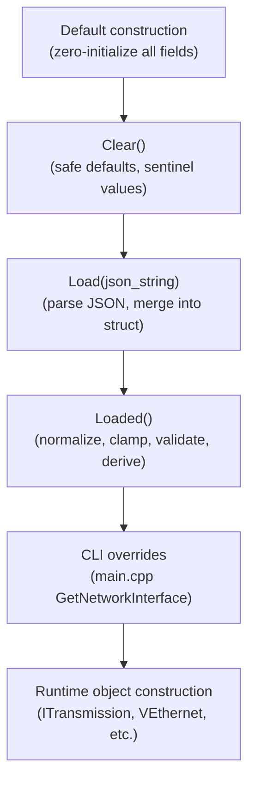
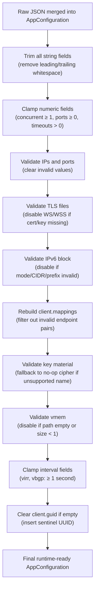
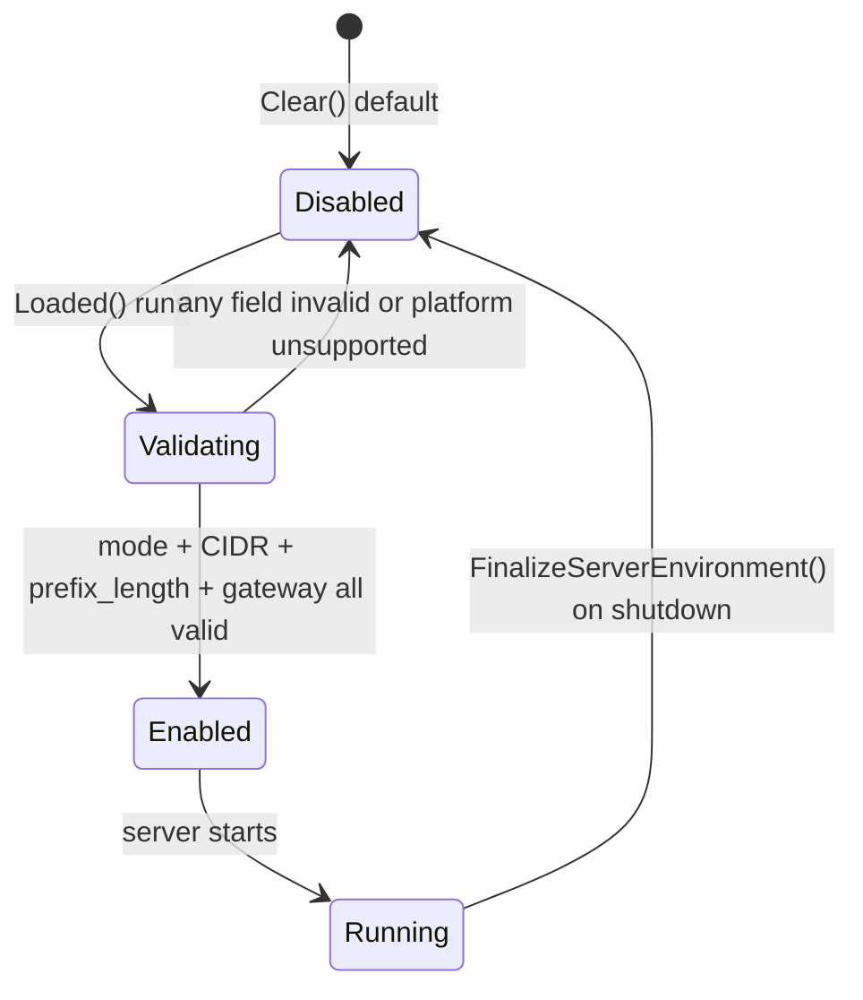
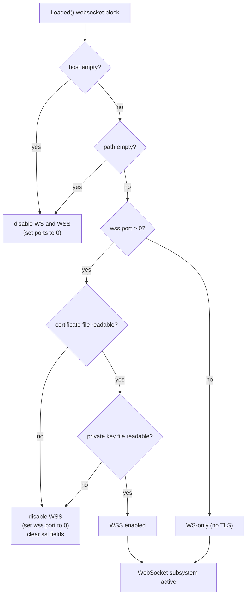
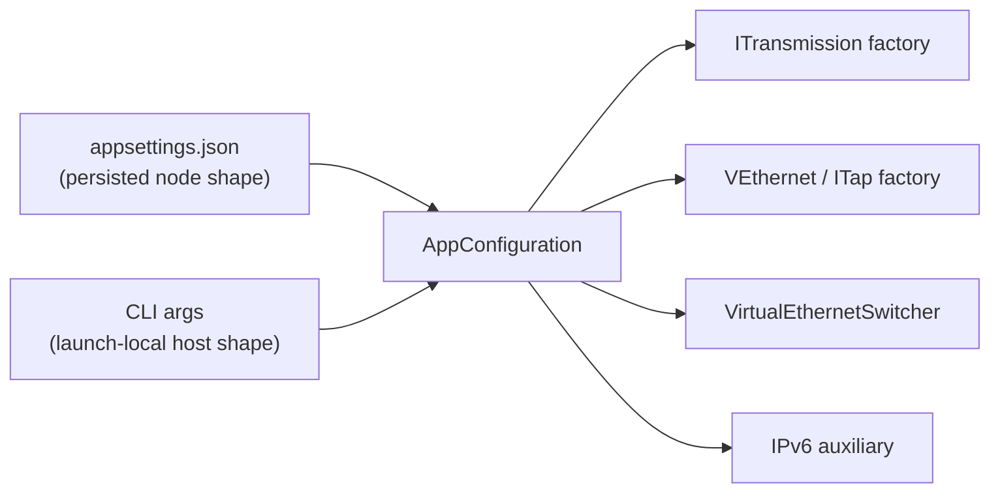
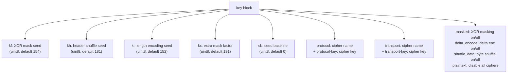

# Configuration Model

[中文版本](CONFIGURATION_CN.md)

## Position

This is the canonical guide to `AppConfiguration` and the launch-time shaping around it. OPENPPP2 does not treat configuration as plain JSON. It uses a staged admission flow:

1. `Clear()` builds safe defaults.
2. `Load(...)` merges JSON.
3. `Loaded()` repairs, clamps, clears, and derives runtime values.
4. `main.cpp` applies per-run CLI overrides for host-specific behavior.

Anchors:

- `ppp/configurations/AppConfiguration.h`
- `ppp/configurations/AppConfiguration.cpp`
- `main.cpp::LoadConfiguration(...)`
- `main.cpp::GetNetworkInterface(...)`
- `main.cpp::PreparedArgumentEnvironment(...)`

---

## 1. Why This Layer Matters

Configuration in OPENPPP2 is not just a bag of scalars. It is a policy object that decides:

- which transport carriers exist
- which runtime branches are enabled
- which platform-side effects will happen
- which values are considered safe enough to keep
- which values must be normalized or discarded

That makes configuration a control surface for the entire repository. A misconfigured node does not just fail to connect — it may expose a degraded security posture, fail to route traffic correctly, or refuse to start at all. The staged admission flow exists precisely to prevent misconfigured nodes from entering the running state silently.

---

## 2. Staged Admission Flow



### Stage 1: `Clear()`

`Clear()` populates every field with a known-safe sentinel. This is important because `Load()` only writes fields present in the JSON; any absent field retains its `Clear()` value, not a zero or garbage value.

### Stage 2: `Load(json_string)`

`Load()` parses the JSON string using the embedded `nlohmann::json` library and maps JSON keys to struct fields. Fields not present in the JSON are left at their `Clear()` values. Parsing errors do not abort — they are surfaced via the return value and by setting `SetLastErrorCode(ConfigFileMalformed)`.

### Stage 3: `Loaded()`

`Loaded()` is the policy compiler. It validates, clamps, repairs, and derives all runtime-ready state. The rules are documented in Section 6 below.

### Stage 4: CLI Overrides

After `Loaded()`, `main.cpp` reads CLI arguments and applies host-specific overrides that are not stored in `appsettings.json` because they describe the physical host environment (which NIC to use, which gateway to route through, which bypass list file to load).

---

## 3. Configuration Shape

`AppConfiguration` is organized around these top-level blocks:

| Block | Runtime Concern |
|-------|----------------|
| `concurrent` | Worker thread pool size |
| `cdn` | Service channel listen ports |
| `ip` | Public and interface IP declarations |
| `udp` | UDP socket policy, DNS, relay timeouts |
| `tcp` | TCP socket policy, connect/inactive timeouts |
| `mux` | MUX channel timeouts, keepalive, and scheduler mode |
| `websocket` | WebSocket carrier configuration |
| `key` | Protocol/transport cipher and obfuscation flags |
| `vmem` | Virtual memory-backed file behavior |
| `server` | Server-side node identity, IPv6, management backend |
| `client` | Client-side identity, server target, proxy, static mappings |
| `virr` | Automatic IP list refresh (Virtual IP Route Refresh) |
| `vbgp` | Periodic virtual BGP route refresh |

### Structural Diagram

```mermaid
graph TD
    CFG["AppConfiguration"] --> CONC["concurrent\n(int: thread count)"]
    CFG --> CDN["cdn\n(port array)"]
    CFG --> IP["ip\n(public_ip, interface_ip)"]
    CFG --> UDP["udp\n(timeout, dns, port, static)"]
    CFG --> TCP["tcp\n(listen, connect, inactive, turbo, fast-open)"]
    CFG --> MUX["mux\n(timeout, keepalive, mode)"]
    CFG --> WS["websocket\n(host, path, listen, ssl, headers)"]
    CFG --> KEY["key\n(kf,kh,kl,kx,sb, protocol, transport,\nmasked, delta_encode, shuffle_data)"]
    CFG --> VMEM["vmem\n(path, size)"]
    CFG --> SRV["server\n(node, log, backend, ipv6, subnet, mapping)"]
    CFG --> CLI["client\n(guid, bandwidth, server, proxy, routes,\nmappings, static, tun, dns-rules)"]
    CFG --> VIRR["virr\n(file, update-interval, retry-interval)"]
    CFG --> VBGP["vbgp\n(server, update-interval)"]
```



---

## 4. Defaults From `Clear()`

Important defaults from `Clear()` include:

| Field | Default | Reason |
|-------|---------|--------|
| `concurrent` | `Thread::GetProcessorCount()` | Use all available CPU cores |
| `cdn[*]` | `IPEndPoint::MinPort` (0) | Disabled until explicitly set |
| `udp.dns.timeout` | 4000 ms | Reasonable DNS query timeout |
| `udp.dns.ttl` | 60 s | DNS cache entry TTL |
| `udp.inactive.timeout` | 72 s | UDP relay idle timeout |
| `tcp.inactive.timeout` | 300 s | TCP relay idle timeout |
| `tcp.connect.timeout` | 15 s | TCP connect attempt timeout |
| `tcp.listen.backlog` | 511 | Standard listen backlog |
| `websocket.listen.ws.port` | 0 | WS disabled |
| `websocket.listen.wss.port` | 0 | WSS disabled |
| `key.kf` | 154 | Key-frame interval default |
| `key.kh` | 181 | Key hash iterations default |
| `key.kl` | 152 | Key length in bits default |
| `key.kx` | 191 | Key exchange algorithm selector default |
| `key.sb` | 0 | Shuffle block size default (0 = disabled) |
| `key.masked` | `true` | Payload XOR masking on |
| `key.delta_encode` | `true` | Delta encoding on |
| `key.shuffle_data` | `true` | Byte shuffling on |
| `server.subnet` | `true` | Server LAN subnet advertising on |
| `server.mapping` | `true` | Port mapping on |
| `server.ipv6.mode` | disabled | IPv6 off by default |
| `client.guid` | sentinel UUID | Placeholder GUID |
| `client.bandwidth` | 0 (unlimited) | No bandwidth cap |
| `virr.update-interval` | 86400 s (1 day) | IP list refresh once per day |
| `virr.retry-interval` | 300 s (5 min) | Retry after download failure |
| `vbgp.update-interval` | 3600 s (1 hour) | Route refresh once per hour |

---

## 5. Meaning Of The Main Blocks

### `concurrent`

This is the process-level concurrency hint. It directly sets the number of worker `io_context` threads spawned by `Executors::SetMaxThreads()`. Setting it to 1 creates a single-threaded event loop; setting it to the CPU core count creates a fully parallel pool. Values below 1 are reset to the CPU count by `Loaded()`.

### `cdn`

CDN ports define listen endpoints for additional service channels. Each entry is an `IPEndPoint`. `IPEndPoint::MinPort` (0) means that entry is disabled. These are used when the server needs to listen on multiple ports for load-balancing or CDN relay scenarios.

### `ip`

Holds two string fields:
- `ip.public` — the server's publicly reachable IP address, advertised to clients in the INFO frame.
- `ip.interface` — the local interface IP to bind listeners to. Empty string means bind to `0.0.0.0` (all interfaces).

### `udp`

Contains all UDP policy:
- `udp.listen.port` — UDP relay listen port.
- `udp.inactive.timeout` — how long a UDP relay socket is kept alive after the last packet.
- `udp.dns.timeout` — timeout for DNS queries forwarded through the tunnel.
- `udp.dns.ttl` — how long resolved DNS entries are cached in the namespace cache.
- `udp.dns.redirect` — comma-separated list of DNS server IPs to redirect queries to.
- `udp.static.port` — static UDP relay port (for fixed-port static mappings).

### `tcp`

Contains TCP socket policy:
- `tcp.listen.port` — main TCP tunnel listen port.
- `tcp.connect.timeout` — timeout for client-side outbound TCP connect attempts.
- `tcp.inactive.timeout` — idle session timeout; sessions with no traffic for this duration are disposed.
- `tcp.turbo` — disables Nagle algorithm (`TCP_NODELAY`) for lower latency at the cost of higher packet rate.
- `tcp.fast-open` — enables TCP Fast Open where supported.
- `tcp.backlog` — listen queue depth; higher values prevent connection drops under burst load.

### `mux`

Controls multiplexing channel behavior:
- `mux.connect.timeout` — timeout for MUX sub-connection establishment.
- `mux.inactive.timeout` — idle timeout for MUX sub-connections.
- `mux.mode` — scheduler mode. `compat` keeps the existing multi-link scheduler under the global VMUX sequence/ack window; `flow`, `balance`, and `stripe` spread one session's frames across multiple links and therefore **auto-negotiate per-flow receiver ordering (flow v2)** so cross-link reordering is not mistaken for loss. `flow` pins each connection to one link (per-connection sticky) so a bulk transfer on one connection cannot head-of-line block another connection's first packets; `balance` binds each connection to a least-loaded link; `stripe` (experimental) spreads frames round-robin across links. An unrecognized value normalizes to `compat` with a non-fatal startup warning.
- `mux.flow-v2` — explicitly enable the negotiated **per-flow receiver ordering** capability (flow v2). Note that `flow`/`balance`/`stripe` already auto-advertise this capability, so you only need to set it for `compat` or to force-advertise; the negotiation is an intersection, so it engages only when **both** peers support it and otherwise falls back to single-link global ordering (`compat`) with no breakage.
- `mux.flow.reorder.bytes` — per-connection reorder buffer byte cap under flow v2 (strictly > 0; default 1048576). Bounds receiver memory: when a connection's buffered out-of-order bytes would exceed this, the oldest gap is skipped (the lost bytes are recovered by the tunneled TCP).
- `mux.flow.reorder.timeout` — per-connection gap wait timeout in milliseconds under flow v2 (strictly > 0; default 2000). If a missing frame does not arrive within this window, the gap is skipped so delivery does not stall.
- `mux.debug.key` — optional shared secret for debug-only remote scheduler control. When non-empty and identical on both peers, a peer may push a mode change via the `--mux-mode-set` CLI flag. Empty (default) disables remote control. The `--mux-mode-set` request is CLI-only and is never persisted to JSON.
- `mux.keep-alived` — MUX keepalive interval range `[min, max]`, in seconds.
- `mux.congestions` — MUX congestion window budget.

The number of parallel MUX sub-connections is still selected by the runtime `--tun-mux=<connections>` flag, not by a `mux.max-connections` JSON key.

### `websocket`

Groups WebSocket carrier configuration:
- `websocket.host` — HTTP Host header value for the WebSocket upgrade request.
- `websocket.path` — HTTP path for the WebSocket upgrade (e.g., `/vpn`).
- `websocket.listen.ws.port` — plain WebSocket listen port (0 = disabled).
- `websocket.listen.wss.port` — TLS WebSocket listen port (0 = disabled).
- `websocket.ssl.*` — TLS certificate, private key, CA bundle, and verification settings.
- `websocket.http.request` / `websocket.http.response` — custom HTTP header injection for the WebSocket upgrade request/response.

Both listeners are disabled by `Loaded()` if `host` or `path` is empty or if required TLS files are invalid.

### `key`

Defines protocol identity and packet transformation policy:

| Field | Type | Meaning |
|-------|------|---------|
| `kf` | int | Key-frame interval (packets between re-key events) |
| `kh` | int | Key hash iterations for KDF strengthening |
| `kl` | int | Key length in bits (e.g. 128, 256) |
| `kx` | int | Key exchange algorithm selector |
| `sb` | int | Shuffle block size used by `shuffle-data` mode |
| `protocol` | string | Protocol-layer cipher name (e.g. `aes-128-cfb`) |
| `protocol-key` | string | Protocol-layer cipher key string |
| `transport` | string | Transport-layer cipher name (e.g. `aes-256-cfb`) |
| `transport-key` | string | Transport-layer cipher key string |
| `masked` | bool | Enable payload XOR masking |
| `delta-encode` | bool | Enable delta encoding of header |
| `shuffle-data` | bool | Enable deterministic byte shuffling |
| `plaintext` | bool | Disable all cipher protection (debug/testing only) |

Unsupported cipher names fall back to a no-op cipher (equivalent to `plaintext = true`) and a warning is set in diagnostics.

### `vmem`

Defines memory-backed virtual file behavior used for session scratch storage:
- `vmem.path` — filesystem path for the virtual memory file.
- `vmem.size` — size in bytes. Values below 1 disable vmem entirely.

### `server`

Defines server-side node identity and behavior:
- `server.node` — integer node ID; clamped to ≥ 0 by `Loaded()`.
- `server.backend` — WebSocket URL of the Go management backend (empty = disabled).
- `server.log` — log file path (empty = disabled).
- `server.subnet` — enable LAN subnet advertisement to clients.
- `server.mapping` — enable static port mapping.
- `server.ipv6` — IPv6 transit plane configuration (mode, CIDR, prefix-length, gateway, static addresses).

### `client`

Defines client-side identity, target server, and traffic policy:
- `client.guid` — client identity UUID; used in session identification.
- `client.bandwidth` — upload/download bandwidth cap in bytes/second (0 = unlimited).
- `client.server` — VPN server URI (e.g. `ppp://host:port/`, `ppp://ws/host:port/`, `ppp://wss/host:port/`).
- `client.server-proxy` — HTTP/SOCKS proxy used to reach the VPN server (empty = direct).
- `client.http.proxy.*` — Local HTTP proxy listener settings (bind address and port).
- `client.socks-proxy.*` — Local SOCKS5 proxy listener settings (bind address, port, username, password). The listener supports TCP `CONNECT` and SOCKS5 `UDP ASSOCIATE`; UDP datagrams are relayed through the client datagram tunnel path.
- `client.routes` — static routes to inject into the OS routing table.
- `client.mappings` — static port mapping declarations (array of `{local, remote}` endpoint pairs).
- `client.static.port` — static tunnel port for server-side static mapping.
- `client.tun.*` — virtual adapter configuration (IP, gateway, mask, name).
- `client.dns-rules` — DNS split-tunneling rules file path.

### `virr`

Controls automatic IP-list (bypass list) refresh:
- `virr.file` — source URL or file path for the IP list download.
- `virr.update-interval` — refresh interval in seconds (clamped to ≥ 1).
- `virr.retry-interval` — interval before retrying a failed download (clamped to ≥ 1).

### `vbgp`

Controls periodic vBGP route refresh from the server:
- `vbgp.server` — vBGP server URL.
- `vbgp.update-interval` — route refresh interval in seconds (clamped to ≥ 1).

---

## 6. Normalization Rules From `Loaded()`

`Loaded()` does the real shaping work. The rules, in category order:



Notable normalization rules:

- `concurrent < 1` resets to `Thread::GetProcessorCount()`.
- `server.node < 0` is clamped to 0.
- `server.ipv6.prefix_length` is clamped to `[1, 128]`.
- Non-positive timeouts fall back to their `Clear()` defaults.
- Invalid port numbers become `IPEndPoint::MinPort` (0 = disabled).
- Negative keepalive counts become 0 (disabled).
- String fields are trimmed before use (leading/trailing spaces removed).
- Empty client GUID falls back to the sentinel GUID.
- Invalid IP strings are cleared to empty string.
- Unsupported cipher protocol/transport names fall back to no-op cipher.
- WebSocket serving is disabled when host/path is empty or certificates are invalid.
- `vmem` is cleared if path is empty or size is below 1.
- `server.ipv6.static_addresses` is filtered: only valid, unique, in-prefix IPv6 addresses are kept.
- `virr.update-interval` is clamped to ≥ 1.
- `virr.retry-interval` is clamped to ≥ 1.
- `vbgp.update-interval` is clamped to ≥ 1.

---

## 7. Derived State Is Important

`Loaded()` is not just input validation. It derives runtime-ready state.

Examples:

- If the websocket host/path pair is unusable, the WS and WSS listeners are disabled — the server will not attempt to bind a port that cannot function correctly.
- If IPv6 mode is unsupported by the platform, related fields are cleared — the IPv6 code paths will not run.
- If the client GUID is empty, a deterministic fallback is inserted — the session will have a valid identity even if the config omitted it.
- If static addresses are invalid (not in the configured prefix), they are removed rather than preserved — the IPv6 assignment table will not contain garbage entries.

This is why `AppConfiguration` is more like a configuration compiler than a passive struct.

---

## 8. IPv6 Server Configuration

IPv6 server mode is not just a boolean. `Loaded()` validates a chain of dependent fields:

| Field | Validation Rule |
|-------|----------------|
| `server.ipv6.mode` | Must be `ula`, `gua`, or similar recognized string |
| `server.ipv6.cidr` | Must parse as a valid IPv6 CIDR block |
| `server.ipv6.prefix_length` | Must be in `[1, 128]` |
| `server.ipv6.gateway` | Must be a valid IPv6 address within the CIDR |
| `server.ipv6.static_addresses` | Each entry must be valid IPv6 and within CIDR |

If any required field is invalid, the entire IPv6 server feature is disabled for that run:



---

## 9. WebSocket Carrier Validation

WebSocket serving depends on a valid host name, a valid path, and (for WSS) valid TLS certificate files:



---

## 10. Client Route Mappings

`client.mappings` is rebuilt from validated mapping entries. The loader accepts either one mapping object or an array of mappings. For each entry:

1. Parse `local` as a valid `IPEndPoint` (host + port).
2. Parse `remote` as a valid `IPEndPoint`.
3. Reject entries where either endpoint has an invalid IP or port.
4. Reject multicast and loopback addresses.
5. Deduplicate by local endpoint.

The result is a normalized `std::vector<MappingEntry>` where every entry is guaranteed to have valid, non-overlapping endpoints. Invalid entries are silently removed rather than causing startup failure — this ensures a partially valid mapping list still produces a functional configuration.

---

## 11. CLI And JSON Relationship

JSON config is durable node intent. CLI values are launch-local overrides.



The CLI layer (`main.cpp::GetNetworkInterface`) writes fields into a `NetworkInterface` struct that is later applied on top of the loaded configuration. CLI-settable values:

| CLI Flag | Overrides |
|---------|-----------|
| `--mode` | Chooses client or server branch |
| `--dns` | `NetworkInterface::DnsAddresses` |
| `--nic` | Physical NIC selection |
| `--ngw` | Physical gateway |
| `--tun-ip` / `--tun-gw` / `--tun-mask` | Virtual adapter addressing |
| `--bypass` | Bypass IP list file(s) |
| `--dns-rules` | DNS rules file |
| `--firewall-rules` | Firewall rules file |

---

## 12. Key Material And Cipher Mode Details

The `key` block controls more than encryption names. The full set of flags that influence the packet transform pipeline:



Setting `plaintext = true` disables all cipher protection — the `protocol_` and `transport_` slots are replaced with no-op pass-through implementations. This is useful for debugging but must never be used in production.

---

## 13. Runtime Shape And Configuration

The configuration decides the shape of the runtime:

| Config Field | Runtime Effect |
|-------------|---------------|
| `concurrent` | Number of worker `io_context` threads |
| `tcp.listen.port > 0` | TCP acceptor is created |
| `websocket.listen.ws.port > 0` | WS acceptor is created |
| `websocket.listen.wss.port > 0` | WSS acceptor with TLS is created |
| `server.backend` non-empty | Go management backend connection is attempted |
| `server.ipv6.mode` valid | IPv6 data plane is initialized |
| `client.http.proxy.*` set | CONNECT-through-proxy mode for outbound connection |
| `client.bandwidth > 0` | `ITransmissionQoS` rate limiter is attached |
| `client.mappings` non-empty | Static port mapping table is built |
| `vmem.path` non-empty | Memory-backed scratch file is created |

---

## 14. What To Watch For When Reading The Code

1. A field might be present in JSON but removed in `Loaded()` — always read `Loaded()` logic before assuming a field from JSON is available at runtime.
2. A missing field may intentionally fall back to a safe default from `Clear()`.
3. A platform-specific branch may clear or ignore fields that are otherwise valid on another OS.
4. The runtime may treat a field as policy input rather than a direct command (e.g., `server.ipv6` enables a whole subsystem, not just one flag).
5. `AppConfiguration` is not `const` after construction — `Loaded()` modifies it in place.

---

## 15. Complete `appsettings.json` Template

```json
{
  "concurrent": 4,
  "cdn": [],
  "ip": {
    "public": "",
    "interface": ""
  },
  "udp": {
    "listen": { "port": 0 },
    "inactive": { "timeout": 72 },
    "dns": {
      "timeout": 4000,
      "ttl": 60,
      "redirect": ""
    },
    "static": { "port": 0 }
  },
  "tcp": {
    "listen": { "port": 2096, "backlog": 511 },
    "connect": { "timeout": 15 },
    "inactive": { "timeout": 300 },
    "turbo": true,
    "fast-open": false,
    "cwnd": 0,
    "rwnd": 0
  },
  "mux": {
    "connect": { "timeout": 15 },
    "inactive": { "timeout": 300 },
    "congestions": 134217728,
    "mode": "compat",
    "keep-alived": [5, 20]
  },
  "websocket": {
    "host": "",
    "path": "",
    "listen": {
      "ws": { "port": 0 },
      "wss": { "port": 0 }
    },
    "ssl": {
      "certificate": "",
      "certificate-key": "",
      "ca-certificate": "",
      "verify-peer": false
    }
  },
  "key": {
    "kf": 154,
    "kh": 181,
    "kl": 152,
    "kx": 191,
    "sb": 0,
    "protocol": "aes-128-cfb",
    "protocol-key": "ChangeThisProtocolKey",
    "transport": "aes-256-cfb",
    "transport-key": "ChangeThisTransportKey",
    "masked": true,
    "plaintext": false,
    "delta-encode": true,
    "shuffle-data": true
  },
  "server": {
    "node": 0,
    "log": "",
    "backend": "",
    "backend-key": "",
    "subnet": true,
    "mapping": true,
    "ipv4-pool": {
      "network": "",
      "mask": ""
    },
    "ipv6": {
      "mode": "",
      "cidr": "",
      "prefix-length": 0,
      "gateway": "",
      "dns1": "",
      "dns2": "",
      "lease-time": 300
    }
  },
  "client": {
    "guid": "00000000-0000-0000-0000-000000000000",
    "bandwidth": 0,
    "server": "ppp://your-server.example.com:20000/",
    "server-proxy": "",
    "http-proxy": {
      "bind": "",
      "port": 0
    },
    "socks-proxy": {
      "bind": "",
      "port": 0,
      "username": "",
      "password": ""
    },
    "routes": [],
    "mappings": [],
    "dns-rules": ""
  },
  "virr": {
    "file": "",
    "update-interval": 86400,
    "retry-interval": 300
  },
  "vbgp": {
    "server": "",
    "update-interval": 3600
  }
}
```

---

## Related Documents

- [`README.md`](../README.md) — Quick-start guide
- [`CLI_REFERENCE.md`](CLI_REFERENCE.md) — All command-line flags
- [`TRANSMISSION.md`](TRANSMISSION.md) — Transport carrier and cipher details
- [`ARCHITECTURE.md`](ARCHITECTURE.md) — System architecture overview
- [`SECURITY.md`](SECURITY.md) — Security architecture and threat model
- [`DEPLOYMENT.md`](DEPLOYMENT.md) — Deployment and operational guidance
