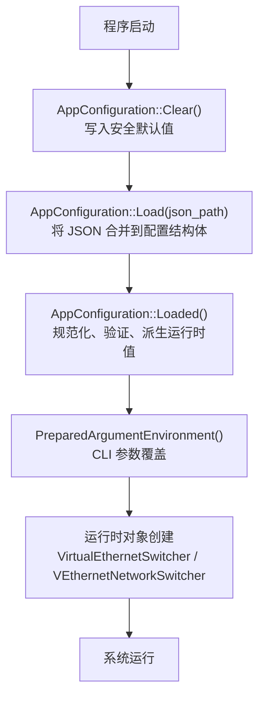
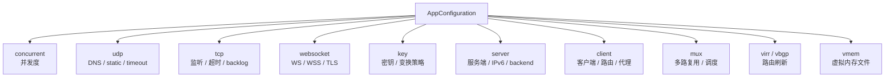
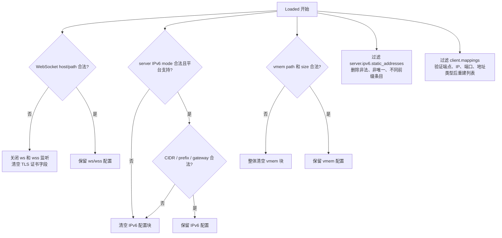
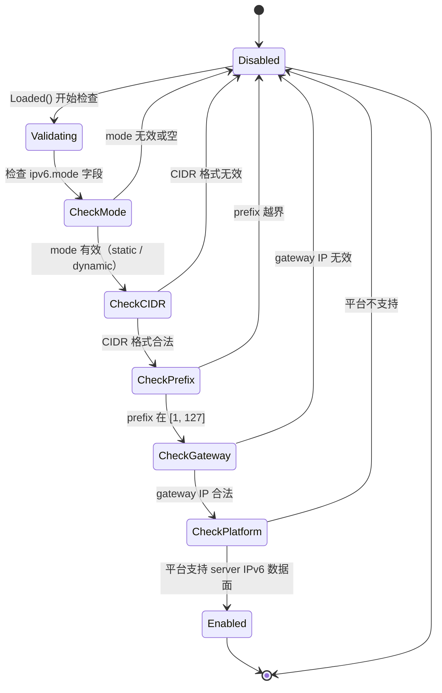
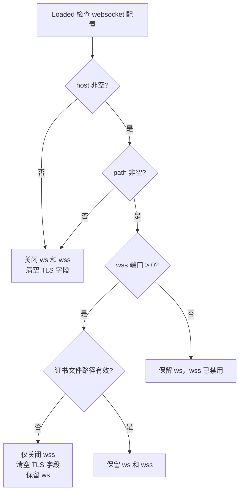
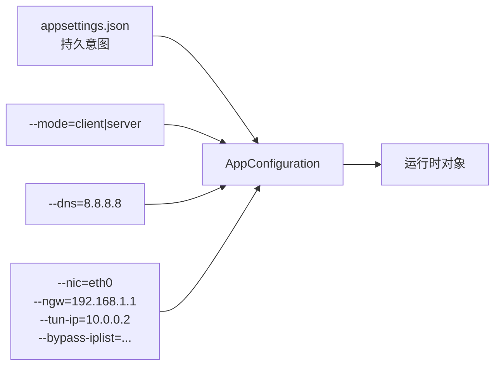
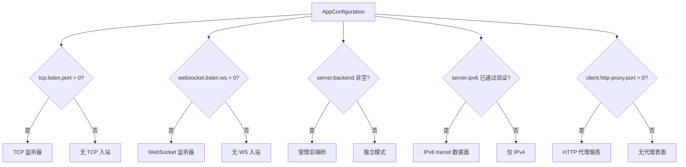

# 配置模型

[English Version](CONFIGURATION.md)

## 1. 定位

本文是 `AppConfiguration` 以及启动期整形逻辑的总说明。OPENPPP2 不把配置当成普通 JSON。它按四步处理：

1. `Clear()` 建立安全默认值。
2. `Load(...)` 合并 JSON。
3. `Loaded()` 修正、裁剪、清理、派生运行值。
4. `main.cpp` 用 CLI 做本次启动的本机覆盖。

核心源码锚点：

- `ppp/configurations/AppConfiguration.h` — 配置结构体定义
- `ppp/configurations/AppConfiguration.cpp` — `Clear()`、`Load()`、`Loaded()` 实现
- `main.cpp::LoadConfiguration(...)` — 文件加载与 `Loaded()` 调用
- `main.cpp::GetNetworkInterface(...)` — 网络接口解析
- `main.cpp::PreparedArgumentEnvironment(...)` — CLI 覆盖逻辑

---

## 2. 为什么这一层重要

OPENPPP2 里的配置不是简单的数值袋。它是一个 **policy 对象**，决定：

- 哪些传输承载存在（TCP / WS / WSS）
- 哪些运行时分支被启用（server IPv6、MUX、FRP、static UDP）
- 哪些平台副作用会发生（DNS flush、路由变更、Wintun 驱动加载）
- 哪些值被视为安全、可以保留
- 哪些值必须被规范化或丢弃

因此配置是整个仓库的**控制面（Control Plane）**。运行时对象的形状由 `AppConfiguration` 决定，而不是由代码中的硬编码逻辑决定。

---

## 3. 分阶段接收流程



---

## 4. 配置结构总览

`AppConfiguration` 由以下主要块组成：

| 块名 | 职责 | 影响对象 |
|------|------|----------|
| `concurrent` | 进程级并发提示，影响 io_context 线程数 | `Executors`、线程池 |
| `cdn` | 某些服务通道的监听默认值 | 监听器 |
| `ip` | public/interface IP 字符串 | 会话绑定 |
| `udp` | UDP timeout、DNS、监听端口、static UDP | 数据报路径、DNS 客户端 |
| `tcp` | TCP timeout、连接策略、监听端口、backlog | `ITcpipTransmission` |
| `mux` | MUX timeout、keepalive 和调度模式 | MUX 通道 |
| `websocket` | WS/WSS 监听、TLS、host/path | `IWebsocketTransmission` |
| `key` | 协议身份和包变换策略 | `ITransmission`、`VirtualEthernetPacket` |
| `vmem` | 内存型虚拟文件行为 | vmem 驱动 |
| `server` | 服务端 node identity、日志、backend、IPv6 | `VirtualEthernetSwitcher` |
| `client` | 客户端身份、目标服务器、代理表面、路由映射 | `VEthernetNetworkSwitcher` |
| `virr` | 自动 IP-list 刷新节奏 | virr 更新器 |
| `vbgp` | 周期性 vBGP 路由刷新节奏 | vBGP 更新器 |



---

## 5. `Clear()` 的默认值体系

`Clear()` 里的关键默认值说明了项目的**安全启动姿态**：

```cpp
// 并发度：默认等于 CPU 核数
concurrent = Thread::GetProcessorCount();

// CDN 端口：默认关闭（MinPort = 0）
cdn[*] = IPEndPoint::MinPort;

// UDP DNS 相关默认值
udp.dns.timeout   = 4000;    ///< DNS 查询超时（毫秒）
udp.dns.ttl       = 60;      ///< DNS 缓存 TTL（秒）
udp.inactive.timeout = 72;   ///< UDP 空闲超时（秒）

// TCP 相关默认值
tcp.connect.timeout  = 5;    ///< TCP 连接超时（秒）
tcp.inactive.timeout = 300;  ///< TCP 空闲关闭超时（秒）
tcp.backlog          = 511;  ///< 监听队列深度

// MUX 相关默认值
mux.connect.timeout  = 5;
mux.inactive.timeout = 300;
mux.mode             = "compat";
mux.congestions      = 134217728;
mux.keep_alived      = [5, 20];

// WebSocket 默认关闭（ws 和 wss 端口均为 0）
websocket.listen.ws  = 0;
websocket.listen.wss = 0;

// Key 材料默认值
key.kf = 154;                 ///< 密钥帧间隔
key.kh = 181;                 ///< KDF 哈希迭代次数
key.kl = 152;                 ///< 密钥长度（位）
key.kx = 191;                 ///< 密钥交换算法选择器
key.sb = 0;                   ///< 混洗块大小（0 = 禁用）

// Server 默认
server.subnet    = true;     ///< 启用子网模式
server.mapping   = true;     ///< 启用端口映射
server.log       = "";       ///< 日志路径（空 = 不写日志）

// Client 默认
client.guid = kSentinelGuid; ///< 哨兵 GUID
client.bandwidth = 0;        ///< 带宽不限制

// Windows 特化
#if defined(_WIN32)
paper_airplane.tcp = true;   ///< 启用 Paper Airplane TCP 加速
#endif

// virr / vbgp 刷新间隔默认值
virr.update_interval = 86400; ///< 24 小时
virr.retry_interval  = 300;   ///< 5 分钟重试
vbgp.update_interval = 3600;  ///< 1 小时
```

---

## 6. `Loaded()` 的规范化规则

`Loaded()` 才是真正的整形层。它不只是输入校验，而是**配置编译器**。主要规则：

### 6.1 数值裁剪规则

| 字段 | 规则 |
|------|------|
| `concurrent` | 小于 1 时回退为 CPU 核数 |
| `server.node` | 不能小于 0；小于 0 时重置为 0 |
| `server.ipv6.prefix_length` | 限制在 `[1, 127]` 范围内 |
| TCP/UDP/MUX timeout | 非正值回退到对应默认值 |
| 端口字段 | 非法端口变成 `IPEndPoint::MinPort`（0） |
| keepalive 间隔 | 负数变成 0 |
| `virr.update_interval` | 至少为 1 |
| `virr.retry_interval` | 至少为 1 |
| `vbgp.update_interval` | 至少为 1 |

### 6.2 字符串规范化

| 字段 | 规则 |
|------|------|
| 所有字符串字段 | 先去掉前后空白（trim） |
| `client.guid` | 空字符串时回退为哨兵值 |
| IP 字段（`ip.public`, `ip.interface`） | 无效 IP 被清空为空字符串 |
| `server.log` | 无效路径被清空 |
| `vmem.path` | 路径或大小不合法时，整个 `vmem` 块被清空 |

### 6.3 子系统关闭逻辑



### 6.4 key 材料规范化

```
key.protocol / key.transport —— 不支持的 cipher 名称回退默认值（aes-256-cfb）
key.kf / key.kh / key.kl / key.kx / key.sb —— 非法值时重置为框架内置值
```

---

## 7. 配置结构详解

### 7.1 `key` 块——密钥与变换策略

`key` 块是最关键的块之一，直接影响 packet transform pipeline。

```json
{
    "key": {
        "protocol": "aes-256-cfb",
        "protocol-key": "base-protocol-secret",
        "transport": "aes-256-cfb",
        "transport-key": "base-transport-secret",
        "masked": true,
        "plaintext": false,
        "delta-encode": true,
        "shuffle-data": true,
        "kf": 154543927,
        "kh": 12,
        "kl": 10,
        "kx": 128,
        "sb": 1000
    }
}
```

| 字段 | 类型 | 作用 |
|------|------|------|
| `protocol` | string | protocol cipher 算法名（如 `aes-256-cfb`） |
| `protocol-key` | string | protocol cipher 的基础密钥；握手后派生 `protocol_` cipher |
| `transport` | string | transport cipher 算法名 |
| `transport-key` | string | transport cipher 的基础密钥；握手后派生 `transport_` cipher |
| `masked` | bool | 在密文上额外添加掩码层（默认 false） |
| `plaintext` | bool | 完全禁用加密（仅开发/测试，生产必须 false） |
| `delta-encode` | bool | 对密文字节启用差分编码 |
| `shuffle-data` | bool | 对 payload 字节做置换混洗 |
| `kf` | int | 密钥帧间隔（每隔多少包触发一次 re-key） |
| `kh` | int | KDF 密钥哈希迭代次数 |
| `kl` | int | 密钥长度（位），如 128、256 |
| `kx` | int | 密钥交换算法选择器 |
| `sb` | int | `shuffle-data` 模式的混洗块大小 |

### 7.2 `server` 块

```json
{
    "server": {
        "node": 0,
        "subnet": true,
        "mapping": true,
        "log": "/var/log/ppp.log",
        "backend": "http://localhost:8080/",
        "backend-key": "backend-auth-key",
        "backend-connect-timeout": 5,
        "ipv6": {
            "address": "fdff::/120",
            "gateway": "fdff::1",
            "prefix": 120,
            "mode": "static"
        }
    }
}
```

| 字段 | 类型 | 作用 |
|------|------|------|
| `node` | int | 节点编号（多服务端部署时用于区分节点），不能小于 0 |
| `subnet` | bool | 是否启用子网模式（服务端下发 LAN 路由给客户端） |
| `mapping` | bool | 是否允许客户端注册端口映射（FRP） |
| `log` | string | 服务端访问日志路径；空字符串表示不写日志 |
| `backend` | string | 管理后端 WebSocket 或 HTTP URL；空字符串表示无后端 |
| `backend-key` | string | 管理后端鉴权密钥 |
| `backend-connect-timeout` | int | 后端连接超时（秒） |
| `ipv6.address` | string | 服务端 IPv6 CIDR 地址池（如 `fdff::/120`） |
| `ipv6.gateway` | string | IPv6 网关地址 |
| `ipv6.prefix` | int | IPv6 前缀长度，限制在 `[1, 127]` |
| `ipv6.mode` | string | `static`（静态分配）或 `dynamic`（动态分配） |

### 7.3 `client` 块

```json
{
    "client": {
        "guid": "{xxxxxxxx-xxxx-xxxx-xxxx-xxxxxxxxxxxx}",
        "server": "ppp://1.2.3.4:20000/",
        "bandwidth": 0,
        "reconnect": true,
        "paper-airplane": {
            "tcp": true
        },
        "http-proxy": {
            "bind": "127.0.0.1",
            "port": 8080
        },
        "mappings": [
            {
                "local-ip": "127.0.0.1",
                "local-port": 3389,
                "remote-port": 3389,
                "protocol": "tcp",
                "type": "in"
            }
        ]
    }
}
```

| 字段 | 类型 | 作用 |
|------|------|------|
| `guid` | string | 客户端唯一标识；空时回退为哨兵 GUID |
| `server` | string | 服务端 URI（`ppp://`、`ppp://ws/`、`ppp://wss/`） |
| `bandwidth` | int | 带宽限制（bps），0 表示不限制 |
| `reconnections.timeout` | int | 断线后重连等待秒数 |
| `paper-airplane.tcp` | bool | 启用 Paper Airplane TCP 加速（仅 Windows） |
| `http-proxy.bind` | string | HTTP 代理监听地址 |
| `http-proxy.port` | int | HTTP 代理端口 |
| `socks-proxy.bind` | string | SOCKS5 代理监听地址 |
| `socks-proxy.port` | int | SOCKS5 代理端口，支持 TCP `CONNECT` 和 SOCKS5 `UDP ASSOCIATE`（UDP 通过客户端 datagram 隧道路由转发） |
| `socks-proxy.username` | string | SOCKS5 认证用户名 |
| `socks-proxy.password` | string | SOCKS5 认证密码 |
| `mappings` | array | FRP 端口映射规则列表 |

客户端 URI 格式：

| URI 格式 | 承载类型 |
|----------|----------|
| `ppp://host:port/` | 原始 TCP |
| `ppp://ws/host:port/` | WebSocket |
| `ppp://wss/host:port/` | TLS WebSocket |

### 7.4 `udp` 块

```json
{
    "udp": {
        "listen": {
            "port": 20000
        },
        "inactive": {
            "timeout": 72
        },
        "dns": {
            "timeout": 4000,
            "ttl": 60,
            "cache": true,
            "redirect": "8.8.8.8:53"
        },
        "static": {
            "aggligator": 4,
            "servers": ["1.0.0.1:20000", "1.0.0.2:20000"]
        }
    }
}
```

### 7.5 `tcp` 块

```json
{
    "tcp": {
        "listen": {
            "port": 20000,
            "nagle": false
        },
        "connect": {
            "timeout": 5
        },
        "inactive": {
            "timeout": 300
        },
        "turbo": false,
        "backlog": 511,
        "fast-open": false
    }
}
```

### 7.6 `mux` 块

```json
{
    "mux": {
        "connect": {
            "timeout": 20
        },
        "inactive": {
            "timeout": 60
        },
        "congestions": 134217728,
        "mode": "compat",
        "keep-alived": [5, 20]
    }
}
```

| 字段 | 类型 | 作用 |
|------|------|------|
| `connect.timeout` | int | MUX 子连接建立超时（秒） |
| `inactive.timeout` | int | MUX 空闲超时（秒） |
| `mode` | string | 调度模式；`compat` 在全局 seq/ack 窗口下保持现有多 link 调度；`flow`、`balance`、`stripe` 会把一个会话的帧分散到**多条链路**，因此**自动协商接收端按流定序（flow v2）**，避免跨链路乱序被误判为丢包。`flow` 把每个连接固定绑定一条链路（按连接粘滞），使某连接的大流量无法对另一连接的首包造成队头阻塞；`balance` 把每个连接绑定到负载最低的 link；`stripe`（实验性）将帧轮询分散到多 link。无法识别的值归一化为 `compat` 并打印非致命启动告警 |
| `flow-v2` | bool | 显式启用可协商的**接收端按流定序**能力（flow v2）。注意 `flow`/`balance`/`stripe` 已会自动广告该能力，因此只有在 `compat` 下或需强制广告时才需设置；协商为交集，仅当**两端**都支持时才启用，否则回退到单链路全局定序（`compat`），不破坏互通 |
| `flow.reorder.bytes` | int | flow v2 下每连接重排缓冲字节上界（严格 > 0，默认 1048576）。约束接收端内存：某连接缓冲的乱序字节将超过该上界时跳过最老缺口（丢失字节由被隧道的 TCP 重传补偿） |
| `flow.reorder.timeout` | int | flow v2 下每连接缺口等待超时（毫秒，严格 > 0，默认 2000）。缺口帧在该窗口内未到达则跳过，避免交付停滞 |
| `debug.key` | string | 调试专用远程控制共享密钥。两端非空且一致时，可用 `--mux-mode-set` 推动对端切换调度模式；空（默认）则关闭远程控制。`--mux-mode-set` 仅命令行有效，不写入 JSON |
| `congestions` | int | MUX 拥塞窗口预算 |
| `keep-alived` | int[2] | keepalive 间隔范围 `[min, max]`（秒） |

并行 MUX 子连接数量仍由运行时 `--tun-mux=<connections>` 指定，不使用 `mux.max-connections` JSON 字段。

---

## 8. IPv6 Server 行为

IPv6 server mode 不是一个简单布尔值。`Loaded()` 会校验 mode、CIDR、prefix length、gateway 和静态地址映射。



如果 `server.ipv6.static_addresses` 不为空，`Loaded()` 会对其进行过滤：
- 移除格式无效的 IPv6 地址
- 移除不在指定前缀内的地址
- 移除重复地址（保留唯一集合）

---

## 9. WebSocket 行为

WebSocket 依赖合法的 host 和 path。条件不满足时，`ws` 和 `wss` 会一起关闭。若 `wss` 关闭，证书字段也会被清空，避免保留无效 TLS 状态。



---

## 10. `client.mappings` 处理

`client.mappings` 不是直接照单全收。`Loaded()` 执行以下验证步骤后重建列表：

1. 验证 `local-ip` 为合法 IP 地址
2. 验证 `local-port` 和 `remote-port` 在有效端口范围 `[1, 65535]`
3. 验证 `protocol` 为 `tcp` 或 `udp`
4. 验证 `type` 为 `in`（入站）或 `out`（出站）
5. 任一验证失败的条目被静默丢弃

也就是说 mapping 配置会被转换成规范化的运行时表，而不是原样复制。

---

## 11. CLI 与 JSON 的关系

JSON 配置是**持久节点意图**，CLI 值是**本次启动的宿主机覆盖**。



主要 CLI 覆盖选项：

| CLI 参数 | 覆盖的配置 | 说明 |
|----------|-----------|------|
| `--mode` | 运行模式 | `client` 或 `server` |
| `--dns` | DNS 服务器地址 | 本次运行使用的 DNS |
| `--nic` | 网络接口名 | 绑定的物理网卡 |
| `--ngw` | 默认网关 | 宿主机网关地址 |
| `--tun-ip` | 虚拟接口 IP | TAP/TUN 接口地址 |
| `--tun-gw` | 虚拟接口网关 | TAP/TUN 接口网关 |
| `--tun-mask` | 虚拟接口子网掩码 | TAP/TUN 接口掩码 |
| `--bypass-iplist` | Bypass IP 列表路径 | 绕过隧道的 IP 段文件 |
| `--dns-rules` | DNS 路由规则 | 特定域名走指定 DNS |

---

## 12. 运行时对象映射

配置块到运行时对象的映射：

| 配置块 | 主要影响的运行时对象 |
|--------|---------------------|
| `tcp` | `ITcpipTransmission`、TCP 监听器、连接器 |
| `websocket` | `IWebsocketTransmission`、`ISslWebsocketTransmission`、HTTP upgrade |
| `key` | `ITransmission`（两个 cipher 槽位）、`VirtualEthernetPacket` |
| `server` | `VirtualEthernetSwitcher`、`VirtualEthernetExchanger`、管理后端桥 |
| `client` | `VEthernetNetworkSwitcher`、`VEthernetExchanger`、HTTP 代理 |
| `udp` | UDP 数据报路径、DNS 客户端、static UDP 聚合器 |
| `mux` | MUX 通道管理器、发送调度模式 |
| `vmem` | vmem 虚拟文件驱动 |
| `virr` | virr IP 列表更新器 |
| `vbgp` | vBGP 路由更新器 |

---

## 13. 配置驱动的运行时形状

配置决定运行时形状（哪些组件存在）：



---

## 14. 读源码时的注意事项

1. **字段可能在 JSON 中存在，但在 `Loaded()` 里被删掉**：平台不支持、依赖字段不满足、格式无效——任何原因都可能导致字段被静默清空。
2. **缺失字段可能是故意回退到安全默认**：`Clear()` 已为每个字段建立安全默认，`Load()` 只覆盖 JSON 中明确指定的字段。
3. **平台分支可能会清空或忽略字段**：某些字段只在 Linux 上有意义（如 `server.ipv6`），在 Windows 上会被 `Loaded()` 清空。
4. **运行时把字段当作 policy 输入，而不是直接命令**：`server.subnet = true` 并不直接开启子网功能，而是告知运行时允许该功能路径，仍需满足其他前提条件。

---

## 15. 常见配置误区

| 误区 | 正确理解 |
|------|---------|
| 设置了 `server.backend` 就会启用认证 | 还需要后端可达且握手成功；不可达时服务端以独立模式运行 |
| WebSocket 只需设置端口 | 还需要 `host` 和 `path` 非空；否则 `Loaded()` 会关闭 WS |
| `plaintext = true` 可用于生产调试 | 不可以，这会完全禁用加密；仅限开发环境 |
| CLI 参数会持久化到配置文件 | 不会，CLI 仅影响本次进程实例 |
| `client.mappings` 中的所有条目都会被应用 | 格式无效的条目会被 `Loaded()` 静默丢弃 |

---

## 16. API 参考

```cpp
/**
 * @brief 将所有配置字段重置为安全默认值。
 *
 * 在 Load() 之前调用。建立配置的"零状态"，确保未在 JSON 中
 * 出现的字段有确定的安全值，而不是随机内存值。
 *
 * @note  不分配任何资源；纯赋值操作。
 */
void Clear() noexcept;

/**
 * @brief 从 JSON 文件加载配置并合并到当前结构体。
 *
 * @param path  JSON 配置文件路径。
 * @return      成功返回 true；文件不存在或 JSON 格式错误返回 false。
 * @note        调用方应在此之前调用 Clear()，之后调用 Loaded()。
 */
bool Load(const ppp::string& path) noexcept;

/**
 * @brief 规范化、验证并派生运行时值。
 *
 * 这是配置的"编译"阶段。它修正非法值、关闭不满足前提的子系统、
 * 派生各运行时对象需要的计算值，并过滤不合法的列表条目。
 *
 * @return  返回对自身的引用（支持链式调用）。
 * @note    必须在 Load() 之后、任何运行时对象创建之前调用。
 *          平台差异处理（如 IPv6 数据面支持检查）在此函数内完成。
 */
AppConfiguration& Loaded() noexcept;
```

---

## 17. 错误码参考

| ErrorCode | 描述 |
|-----------|------|
| `ConfigLoadFailed` | JSON 文件加载失败（文件不存在或格式错误） |
| `ConfigLegacyCipherAlgorithm` | key 块包含无效密钥材料（空字符串或不支持的 cipher） |
| `NetworkAddressInvalid` | 配置的 IP 或端口格式无效 |
| `SocketConnectFailed` | 管理后端在配置的超时内无法连接 |
| `ConfigurationIpv6Unsupported` | 当前平台不支持 server IPv6 数据面 |

> **注**：`ConfigurationIpv6Unsupported` 为拟新增/设计项，不在当前 `ErrorCodes.def`（近似现有码 `IPv6Unsupported` 或 `Ipv6ServerRoleNotSupportedOnPlatform`）。

---

## 相关文档

- [`README_CN.md`](README_CN.md) — 项目概览
- [`CLI_REFERENCE_CN.md`](CLI_REFERENCE_CN.md) — CLI 参数完整参考
- [`TRANSMISSION_CN.md`](TRANSMISSION_CN.md) — key 块对传输层的影响
- [`ARCHITECTURE_CN.md`](ARCHITECTURE_CN.md) — 系统架构与配置驱动的组件关系
- [`DEPLOYMENT_CN.md`](DEPLOYMENT_CN.md) — 部署场景下的配置建议
- [`SECURITY_CN.md`](SECURITY_CN.md) — key 块与安全模型
