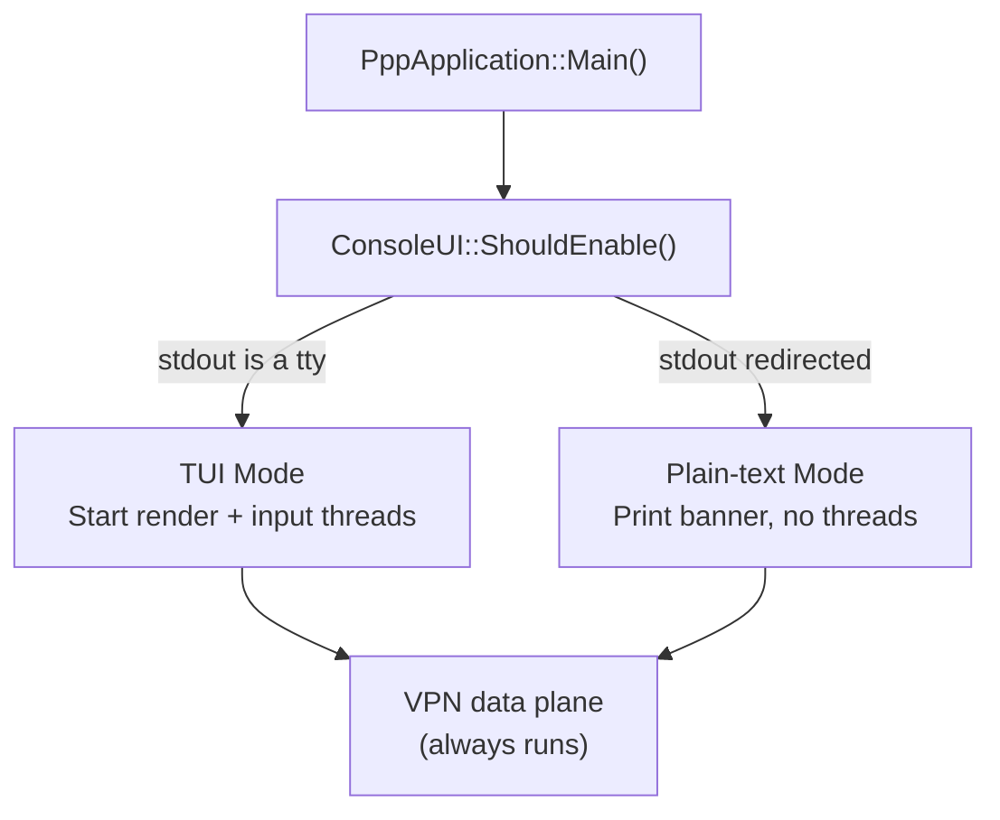
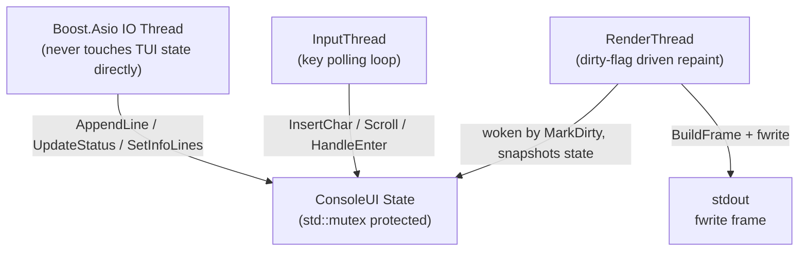
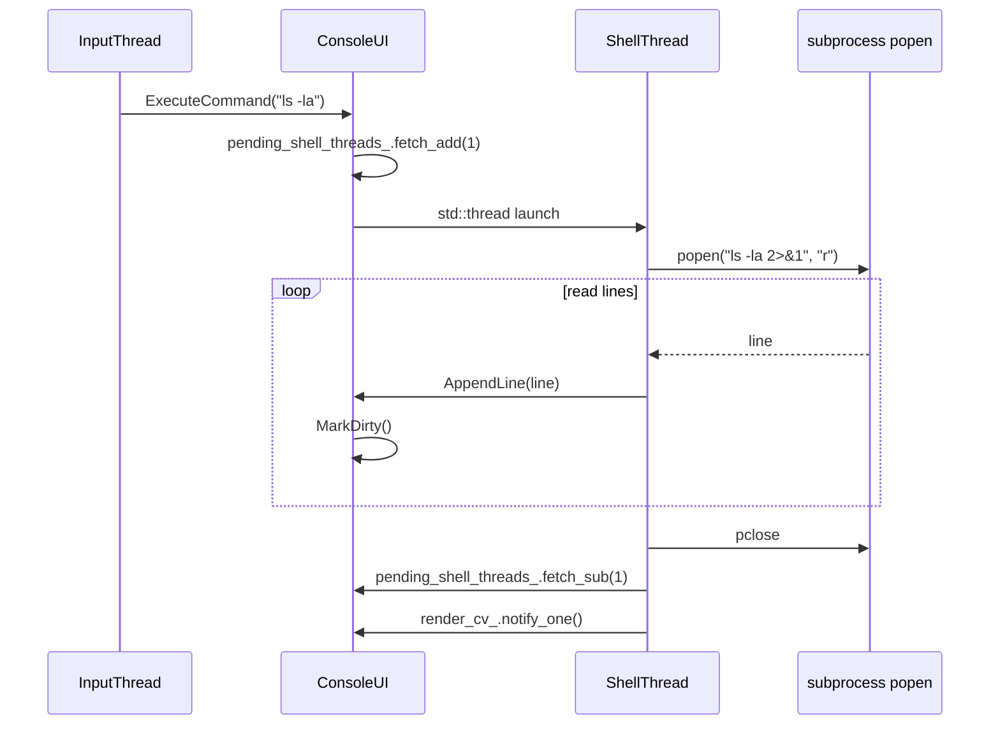
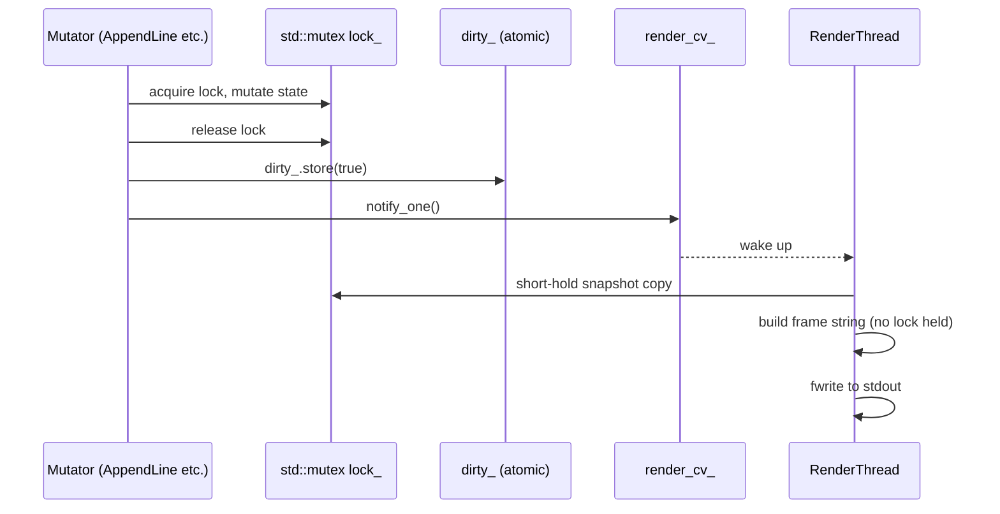
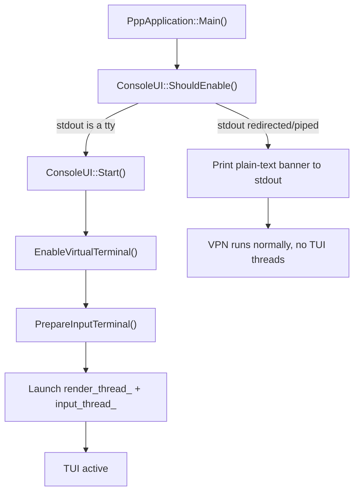
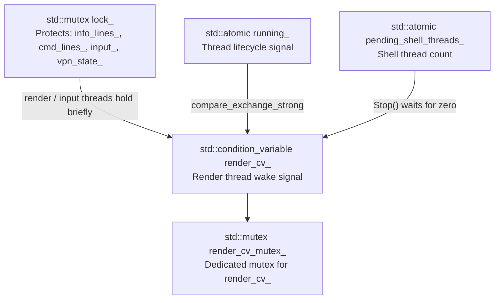
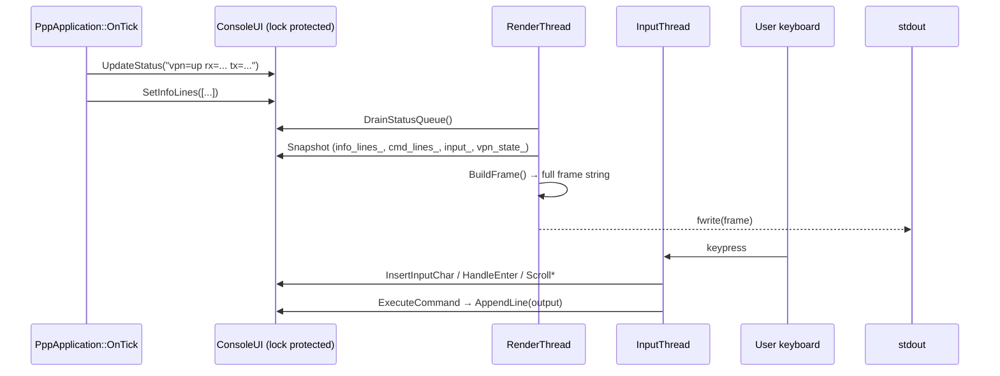
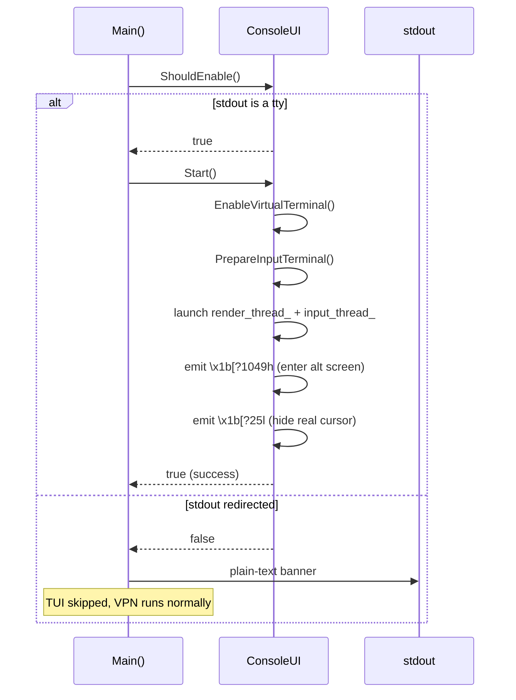
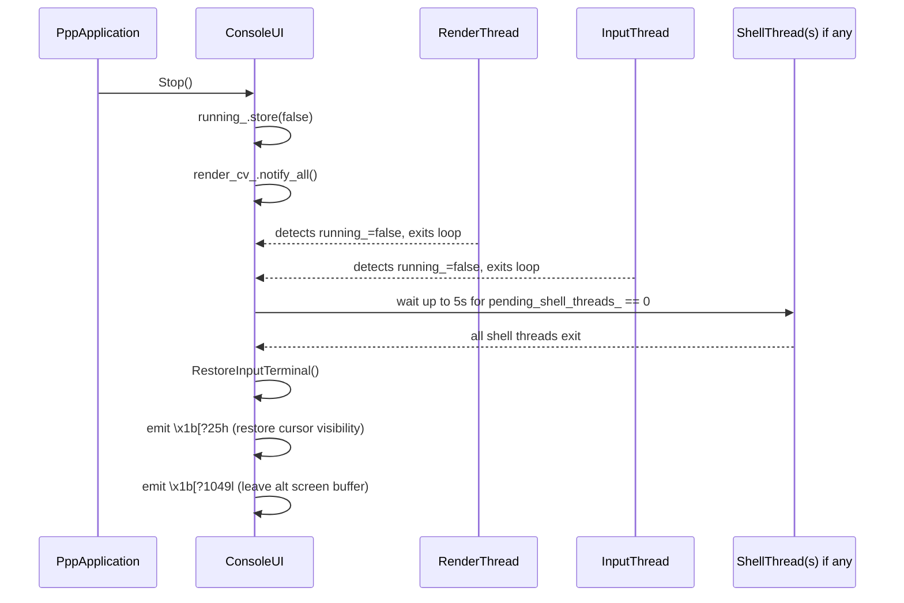

# TUI Design — PPP PRIVATE NETWORK™ 2 Console Interface

[中文版本](TUI_DESIGN_CN.md)

## Overview

The ConsoleUI subsystem (`ppp/app/ConsoleUI.h`, `ppp/app/ConsoleUI.cpp`) implements a
singleton full-screen, box-drawing terminal UI that runs inside the existing application
process. It is divided into three independently scrollable sections (VPN info, command
output, and input line) and uses two dedicated threads (render and input) so that all
blocking I/O stays completely off the Boost.Asio event loop.

When stdout is not connected to a real terminal (e.g. output redirected to a file or
pipe), the TUI is skipped entirely and basic startup information is printed in plain-text
format instead.



---

## Layout

```
┌──────────────────────────────────────────────────────────────────────┐  row 0
│ PageUp/PageDown: Scroll command input/output   PPP PRIVATE NETWORK™ 2│  row 1
│ Home/End       : Scroll openppp2 info                                │  row 2
│          ___  ____  _____ _   _ ____  ____  ____ ____               │  row 3
│         / _ \|  _ \| ____| \ | |  _ \|  _ \|  _ \___ \             │  row 4
│        | | | | |_) |  _| |  \| | |_) | |_) | |_) |__) |            │  row 5
│        | |_| |  __/| |___| |\  |  __/|  __/|  __// __/             │  row 6
│         \___/|_|   |_____|_| \_|_|   |_|   |_|  |_____|            │  row 7
│                                                                      │  row 8
├──────────────────────────────────────────────────────────────────────┤  row 9
│  [Info section — scrollable with Home / End]                         │
│  VPN interface name, address, status, statistics ...                 │
├──────────────────────────────────────────────────────────────────────┤
│  [Cmd section — scrollable with PageUp / PageDown]                   │
│  command output, shell subprocess output, built-in command output... │
├──────────────────────────────────────────────────────────────────────┤
│  > [input line or dim placeholder, white-background block as caret]   │
├──────────────────────────────────────────────────────────────────────┤
│  [WARN] 118 SocketDisconnected: Socket disconnected (5s ago)         │
└──────────────────────────────────────────────────────────────────────┘
```

### Fixed rows

| Section              | Rows  |
|----------------------|-------|
| Top border           | 1     |
| Hint lines           | 2     |
| ASCII art            | 5     |
| Empty spacer         | 1     |
| Header separator     | 1     |
| **Total (header)**   | **10**|

| Section              | Rows  |
|----------------------|-------|
| Input separator      | 1     |
| Input row            | 1     |
| Status separator     | 1     |
| Status bar           | 1     |
| Bottom border        | 1     |
| **Total (footer)**   | **5** |

### Dynamic allocation

```
middle      = terminal_height - 10 - 5
info_height = max(2,  (middle - 1) * 3 / 5)
cmd_height  = max(1,  middle - 1 - info_height)   // -1 for info/cmd separator
```

Minimum supported terminal size: **40 × 20**.

---

## Thread Model

TUI uses two dedicated threads that are completely decoupled from the Boost.Asio IO threads:



The IO thread (and any Asio-posted coroutine) calls `AppendLine`, `UpdateStatus`, or
`SetInfoLines` to push data into the TUI. These calls acquire `lock_`, mutate state, then
release `lock_` and call `MarkDirty()`. The render thread wakes, takes a snapshot while
holding `lock_` for the minimum time, then constructs the complete frame string while
holding no lock, and finally calls `fwrite` to emit the frame atomically.

---

## Box-Drawing Character Encoding

All border characters are encoded as UTF-8 3-byte sequences. Each character
occupies exactly **one display column** on any compliant terminal.

| Symbol | Unicode | UTF-8 bytes      |
|--------|---------|------------------|
| `┌`    | U+250C  | E2 94 8C         |
| `┐`    | U+2510  | E2 94 90         |
| `└`    | U+2514  | E2 94 94         |
| `┘`    | U+2518  | E2 94 98         |
| `├`    | U+251C  | E2 94 9C         |
| `┤`    | U+2524  | E2 94 A4         |
| `┬`    | U+252C  | E2 94 AC         |
| `┴`    | U+2534  | E2 94 B4         |
| `─`    | U+2500  | E2 94 80         |
| `│`    | U+2502  | E2 94 82         |

The frame builder (`BuildFrame()`) constructs the entire output as a single `ppp::string`
and emits it with a single `fwrite`. This eliminates the partial-write interleaving that
would occur if each line were written individually.

---

## ASCII Art Coloring

The five-line art for "OPENPPP2" is split at display column **24**:

- Columns `[0, 24)` → dark gray ANSI `\x1b[90m` (represents **OPEN**)
- Columns `[24, end)` → bold bright-white ANSI `\x1b[1;97m` (represents **PPP2**)

Colors are only applied when `vt_enabled_` is true (VT100 processing confirmed on the
current console handle).

The split is intentional: "OPEN" appears subdued to draw the eye toward "PPP2", which
renders in prominent bold white. This makes the brand mark immediately readable even in
terminal themes with low contrast.

---

## Key Bindings

| Key                | Action                                          |
|--------------------|-------------------------------------------------|
| `Home`             | Scroll info section to top (oldest content)     |
| `End`              | Scroll info section to bottom (newest)          |
| `PageUp`           | Scroll cmd section up (toward older output)     |
| `PageDown`         | Scroll cmd section down (toward newest)         |
| `Up Arrow`         | Recall previous command from history            |
| `Down Arrow`       | Recall next command / restore current input     |
| `Left Arrow`       | Move text cursor left                           |
| `Right Arrow`      | Move text cursor right                          |
| `Ctrl+A`           | Move cursor to beginning of line                |
| `Ctrl+E`           | Move cursor to end of line                      |
| `Backspace`        | Erase character before cursor                   |
| `Delete`           | Erase character at cursor                       |
| `Enter`            | Execute command                                 |

---

## Built-In Commands

| Command               | Action                                           |
|-----------------------|--------------------------------------------------|
| `openppp2 help`       | Print command list to cmd output section         |
| `openppp2 restart`    | Graceful restart via `ShutdownApplication(true)` |
| `openppp2 reload`     | Same action as restart                           |
| `openppp2 exit`       | Exit via `ShutdownApplication(false)`            |
| `openppp2 info`       | Pull and print full runtime environment snapshot |
| `openppp2 clear`      | Clear cmd output ring buffer                     |
| `openppp2 telemetry status` | Print current telemetry configuration      |
| `openppp2 telemetry help`   | Print telemetry subcommand usage            |
| `openppp2 telemetry log on\|off\|toggle`     | Enable / disable / toggle telemetry log console output filter |
| `openppp2 telemetry metric on\|off\|toggle`  | Enable / disable / toggle metric console output filter |
| `openppp2 telemetry span on\|off\|toggle`    | Enable / disable / toggle span console output filter |
| `openppp2 telemetry level 0\|1\|2\|3`        | Set telemetry verbosity threshold (0=Info … 3=Trace) |
| `openppp2 telemetry all`     | Enable all console telemetry filters (log + metric + span) |
| `openppp2 telemetry quiet`   | Disable all console telemetry filters |
| `openppp2 telemetry clear`   | Clear telemetry event buffer |
| *(any other input)*   | Execute as shell command, capture output         |

Bare commands such as `help`, `restart`, `exit`, `clear`, and `status` are not mapped to
built-in handlers. They are executed as shell commands.

### Telemetry Control Commands

> **Migration note:** Previous versions exposed single-character telemetry hotkeys (`l`, `m`,
> `s`, `0`–`3`, `a`, `q`, `?`) that were intercepted immediately on keypress. These hotkeys
> have been **removed** because they interfered with normal shell input — for example, typing
> an `l` in a shell command could unintentionally toggle telemetry logging.
>
> Telemetry is now controlled exclusively through the `openppp2 telemetry …` command
> namespace. The TUI only parses telemetry commands after `Enter` is pressed, treating the
> entire input line as a complete command. This eliminates the interception and input
> truncation problems of the old hotkey model.

| Command | Equivalent to |
|---------|---------------|
| `openppp2 telemetry` | `openppp2 telemetry status` |
| `openppp2 telemetry status` | Prints current enabled/disabled state of log, metric, span, and the active verbosity threshold |
| `openppp2 telemetry help` | Prints the full telemetry subcommand reference |
| `openppp2 telemetry log on` | Enables telemetry log console output filter (`SetConsoleLogEnabled`) |
| `openppp2 telemetry log off` | Disables telemetry log console output filter |
| `openppp2 telemetry log toggle` | Toggles telemetry log console output filter |
| `openppp2 telemetry metric on` | Enables metric console output filter (`SetConsoleMetricEnabled`) |
| `openppp2 telemetry metric off` | Disables metric console output filter |
| `openppp2 telemetry metric toggle` | Toggles metric console output filter |
| `openppp2 telemetry span on` | Enables span console output filter (`SetConsoleSpanEnabled`) |
| `openppp2 telemetry span off` | Disables span console output filter |
| `openppp2 telemetry span toggle` | Toggles span console output filter |
| `openppp2 telemetry level 0` | Verbosity threshold: Info only |
| `openppp2 telemetry level 1` | Verbosity threshold: Info + Verb |
| `openppp2 telemetry level 2` | Verbosity threshold: Info + Verb + Debug |
| `openppp2 telemetry level 3` | Verbosity threshold: Info + Verb + Debug + Trace (all) |
| `openppp2 telemetry all` | Enables all console telemetry filters (log + metric + span) |
| `openppp2 telemetry quiet` | Disables all console telemetry filters (log + metric + span) |
| `openppp2 telemetry clear` | Clears telemetry event buffer (TUI right panel) |

> **Note:** The `log`, `metric`, and `span` commands only toggle console/local output
> filters. They do **not** change global telemetry runtime gates (`telemetry.enabled`,
> count gates, or span gates) or the verbosity threshold configured in
> `appsettings.json`. Similarly, `level` controls only the console verbosity threshold
> and does not affect the configuration file setting.

The `telemetry` namespace requires the `openppp2` prefix — bare `telemetry` input will be
executed as a shell command.

### System Command Execution

Non-built-in commands are executed in a **tracked `std::thread`** to avoid blocking the
input loop:

- **Windows**: `cmd /c <command> 2>&1`
- **Linux / macOS**: `<command> 2>&1`

Output lines from the subprocess are appended to `cmd_lines_` one at a time via
`AppendLine()`. The shell thread reads lines from the subprocess `FILE*` pipe in a loop
and calls `AppendLine()` for each line.

Thread lifecycle is tracked via a `pending_shell_threads_` (`std::atomic<int>`) counter:
the counter is incremented before the thread is launched and decremented (with
`render_cv_.notify_one()`) when it exits. `Stop()` performs a bounded wait (up to 5 s)
for the counter to reach zero before tearing down shared state, preventing use-after-free
on the ConsoleUI instance.



---

## Refresh Strategy (Flicker-Free)

The render pipeline is designed around three principles: **no per-frame cursor
toggling**, **no per-frame full-screen clear**, and **repaint-on-demand** driven
by a dirty flag. Together these eliminate all cursor flicker and stdout churn
that plagued earlier revisions of this subsystem.

```
RenderLoop (condition_variable tick, max 100 ms)
  ├─ render_cv_.wait_for(lock, 100ms)
  ├─ DrainStatusQueue()     — short-lock swap of status_queue_, process outside lock
  ├─ need_redraw = dirty_.exchange(false) || force_redraw_
  ├─ if (terminal size changed) force_redraw_ = true; need_redraw = true
  ├─ if (need_redraw) RenderFrame()
  └─ (loop — woken immediately by MarkDirty() or up to 100 ms idle wait)
```

Every public mutator (`AppendLine`, `UpdateStatus`, `SetInfoLines`, every
`Insert*` / `Move*` / `Erase*` / `Scroll*` method, and `HandleEnter`) calls
`MarkDirty()` after releasing the lock. `MarkDirty()` also calls
`render_cv_.notify_one()`, so the render thread wakes within microseconds of
any UI state change rather than at a fixed 20 Hz cadence. The render thread
coalesces multiple dirty marks into a single frame draw, so bursty input does
not produce bursty I/O.

`DrainStatusQueue()` uses a two-phase lock pattern: acquire `lock_` for a
minimum-duration `std::swap` of the queue into a local variable, release
`lock_`, process the local variable (string parsing, `ToLower`, `find`,
`substr`, etc.), then acquire `lock_` again only for the final write-back of
`vpn_state_text_` and `speed_text_`. This keeps the render thread's lock hold
time minimal.



### Cursor Handling (Flicker-Free)

The real terminal cursor is **hidden for the entire lifetime of the TUI
session** and is only made visible again by `Stop()` during shutdown. The
caret position inside the editor line is conveyed by a single white-background
block that `BuildEditorLine()` embeds at the appropriate byte offset:

```
> Editor text with caret█here
             ^^^^^^^^^^^
             rendered as "\x1b[47m h\x1b[0m"  (white-background 'h')
```

Because the block is part of the rendered string, it moves atomically with
every other character in the frame and never produces the cursor-jitter that
arises from cyclic `\x1b[?25h` / `\x1b[?25l` sequences.

### Minimal-Clear Strategy

`RenderFrame()` emits:

| Condition                        | Escape sequence emitted              |
|----------------------------------|--------------------------------------|
| First frame after `Start()`     | `\x1b[2J\x1b[H` (full clear + home) |
| Terminal size changed            | `\x1b[2J\x1b[H` (full clear + home) |
| All other frames                 | `\x1b[H` (cursor home only)          |

Each row in the frame string already occupies the full terminal width (the
box builders right-pad to exactly `width` columns), so a simple cursor-home
followed by a full-height overwrite is sufficient to erase the previous
frame without the screen flash produced by `\x1b[2J`.

### Alternate Screen Buffer

`Start()` enters the terminal's alternate screen buffer via `\x1b[?1049h`
and `Stop()` leaves it via `\x1b[?1049l`. The alt-screen buffer is
preserved by the terminal emulator, so when the TUI exits the user's
original shell prompt, scrollback, and cursor position re-appear exactly
as they were before the process launched.

On Windows the pre-session console output mode (`GetConsoleMode`) and cursor
visibility (`GetConsoleCursorInfo`) are additionally snapshotted at `Start()`
and restored in `Stop()`.

---

## No-TTY Fallback

```
ConsoleUI::ShouldEnable()
  ├─ Windows: _isatty(_fileno(stdout))
  └─ POSIX:   isatty(STDOUT_FILENO)
```

When `ShouldEnable()` returns `false`:

1. `ConsoleUI::Start()` is **not** called.
2. `PppApplication::Main()` prints a one-time plain-text banner to `stdout`:
   - Application version
   - Mode (client / server)
   - Process ID
   - Config file path
   - Working directory
3. The process continues with full VPN functionality.
4. No render thread, no input thread.

This ensures log capture via `./ppp > log.txt` or piped output works without interference.

If `ShouldEnable()` returns `true` but `ConsoleUI::Start()` later fails during terminal
preparation or optional thread startup, the process now degrades to the same plain-text
path and publishes `RuntimeOptionalUiStartFailed` as a warning-level diagnostic rather
than treating optional UI setup as a fatal runtime failure.



---

## Thread Safety

All mutable ConsoleUI state is protected by a single `std::mutex lock_`. The render
thread and the input thread both acquire `lock_` for short critical sections (snapshot
copies) and then work on their local copies.

`running_` is a `std::atomic<bool>` used for lock-free thread lifecycle signaling with
`compare_exchange_strong(memory_order_acq_rel)`.

`pending_shell_threads_` (`std::atomic<int>`) tracks the count of live shell subprocess
threads. `Stop()` waits (bounded by 5 s) until this counter reaches zero before
destroying shared state.

`render_cv_` (`std::condition_variable`) is used by `MarkDirty()` and the shell threads
to wake the render thread without spinning. It is guarded by `render_cv_mutex_`
(separate from `lock_` to avoid contention).



---

## Data Flow



---

## TUI Startup Sequence



---

## TUI Shutdown Sequence



---

## Platform Differences

| Feature              | Windows                                         | POSIX                                 |
|----------------------|-------------------------------------------------|---------------------------------------|
| Input reading        | `_kbhit()` + `_getch()` polling                | `poll()` + `read(STDIN_FILENO)`        |
| Input mode           | `PrepareInputTerminal()` clears `ENABLE_ECHO_INPUT` and `ENABLE_LINE_INPUT`; `RestoreInputTerminal()` restores | `tcsetattr` disables `ICANON`/`ECHO`/`ISIG` |
| Terminal state save  | `GetConsoleMode` + stdin mode                  | `tcgetattr` + `fcntl` flags           |
| Alt screen buffer    | `\x1b[?1049h/l` (requires VT enabled)         | `\x1b[?1049h/l`                       |
| VT enable            | `ENABLE_VIRTUAL_TERMINAL_PROCESSING`           | Supported by default                  |

**Scroll bounds:** The maximum scroll offset for both the info and cmd panels is clamped
to `max(0, (int)content_lines - panel_height)`. This prevents over-scrolling past the
last content line and eliminates the blank rows that appeared at the top of the panel
in earlier revisions.

---

## Public API Reference

### `static bool ConsoleUI::ShouldEnable()`

**Brief:** Detects whether stdout is connected to a real terminal.

**Returns:** `true` if stdout is a tty; `false` if redirected or piped.

**Note:** Must be called before `Start()`. If this returns `false`, calling `Start()` is
a no-op and the TUI will not initialize.

---

### `bool ConsoleUI::Start()`

**Brief:** Initializes the TUI subsystem: enables VT processing, prepares raw input
terminal mode, enters the alternate screen buffer, hides the real cursor, and launches
the render and input threads.

**Returns:** `true` on success; `false` if initialization failed at any step.

**Note:** This method is `noexcept`. Internal startup exceptions are caught, partial state
is rolled back, and the caller can continue in plain-text mode. Failed optional TUI startup
publishes `RuntimeOptionalUiStartFailed`.

---

### `void ConsoleUI::Stop()`

**Brief:** Signals all threads to stop, waits for shell subprocess threads to finish
(bounded to 5 seconds), restores the terminal to its pre-TUI state, restores cursor
visibility, and leaves the alternate screen buffer.

**Note:** Safe to call multiple times. The second and subsequent calls are no-ops due to
`running_.compare_exchange_strong()` guard.

---

### `void ConsoleUI::AppendLine(ppp::string line)`

**Brief:** Appends one line to the command output ring buffer and wakes the render thread.

**Parameters:**
- `line` — The string to append. May contain ANSI escape sequences. Must not be empty.

**Thread safety:** Acquires `lock_`. Safe to call from any thread.

---

### `void ConsoleUI::SetInfoLines(ppp::vector<ppp::string> lines)`

**Brief:** Replaces the entire content of the info section with the provided lines.

**Parameters:**
- `lines` — Vector of strings. Each string represents one line in the info panel.

**Thread safety:** Acquires `lock_`. Safe to call from any thread.

---

### `void ConsoleUI::UpdateStatus(ppp::string status)`

**Brief:** Pushes a status string to the internal status queue. The render thread drains
the queue via `DrainStatusQueue()` and parses it to update runtime state/speed cache.

**Parameters:**
- `status` — Space-separated key=value pairs, e.g. `"vpn=up rx=1024 tx=2048"`.

**Thread safety:** Acquires `lock_` only for a queue push. Safe to call
from any thread including the IO thread at high frequency.

### Status bar semantics

The bottom status row is split into two columns:

- **Left column**: Diagnostics snapshot text and telemetry filter indicators.
  - `[INFO] 0 Success: Success` when `ErrorCode::Success` is active.
  - `[%LEVEL%] <numeric_id> <CodeName>: <message> (<age>)` for the last non-success error.
  - Telemetry filter state: `  | T:LMS @<level> (openppp2 telemetry help)` where each of `L`, `M`, `S` is shown when the
    corresponding console filter (log, metric, span) is enabled, or `-` when disabled. `<level>`
    is the current verbosity threshold (0–3).
  - ANSI color follows severity: info=green, warn=yellow, error=red, fatal=bright red.
- **Right column**: VPN state and throughput summary (e.g. `VPN: connected  ↑ 1.2MB/s  ↓ 3.4MB/s`).

Both columns are rendered in a single `BoxSplitRow()` call with a vertical divider.

---

## Ring Buffer Sizing

The command output section uses a ring buffer (`cmd_lines_`) with a configurable maximum
line count. When the buffer is full, the oldest lines are discarded. The default maximum
is chosen to hold several thousand lines, balancing memory use against the ability to
scroll back through command history.

The info section (`info_lines_`) is replaced wholesale on each `SetInfoLines()` call.
It is not a ring buffer; it reflects the current VPN state snapshot.

---

## Error Code Reference

TUI subsystem error codes (from `ppp/diagnostics/ErrorCodes.def`):

| ErrorCode                | Description                                               |
|--------------------------|-----------------------------------------------------------|
| `RuntimeEnvironmentInvalid` | Terminal setup or VT initialization failed           |
| `RuntimeThreadStartFailed`  | Render/input worker thread failed to launch          |

---

## Related Source Files

- `ppp/app/ConsoleUI.h` / `ppp/app/ConsoleUI.cpp` — TUI main implementation
- `ppp/app/ApplicationInitialize.cpp` — TUI start/stop integration point (isatty fallback)
- `ppp/app/ApplicationMainLoop.cpp` — Pushes data to TUI via `UpdateStatus` / `SetInfoLines`
- `ppp/stdafx.cpp::HideConsoleCursor` — Cross-platform cursor visibility primitive

---

## References

- VT100 / ANSI escape sequences: ECMA-48
- Alternate screen buffer: xterm control sequences, DEC Private Mode 1049
- Minimal-clear philosophy: inspired by ncurses `wnoutrefresh` + `doupdate` double-buffer
