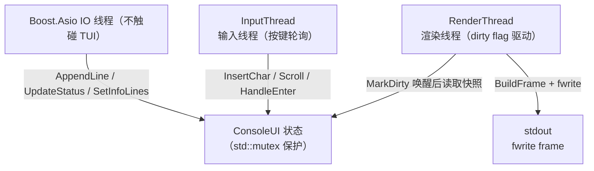
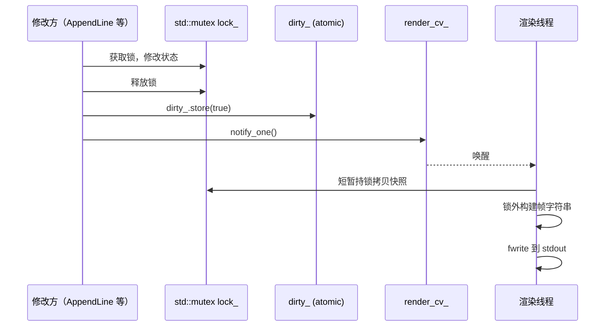
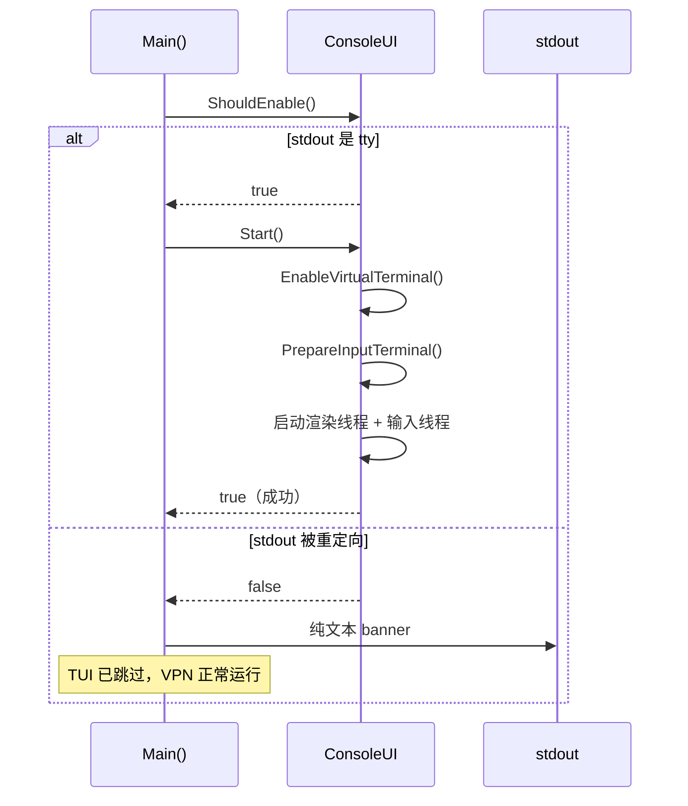
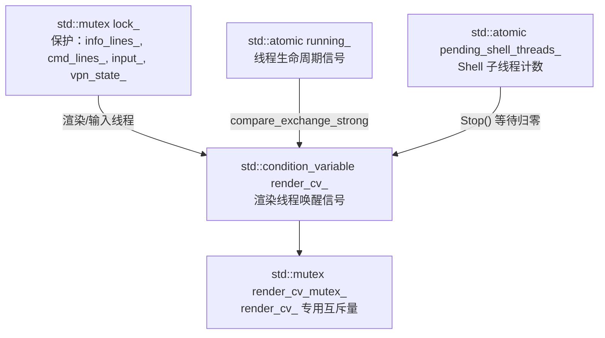
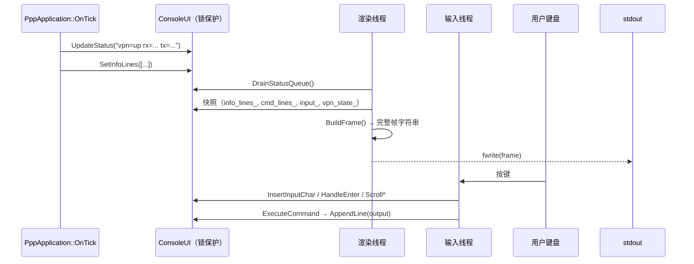
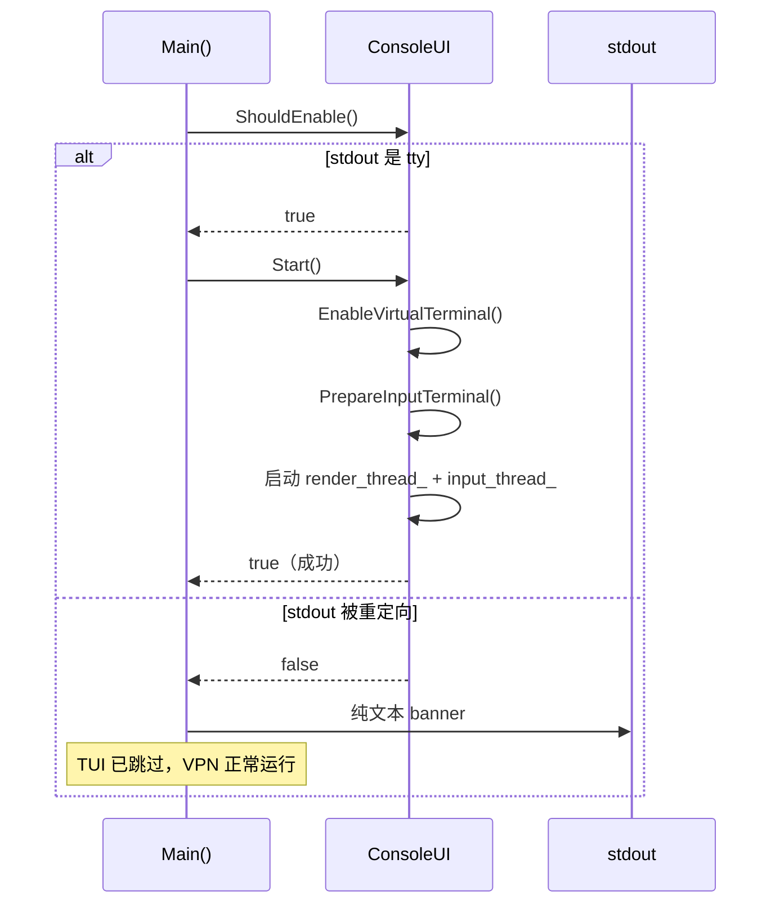
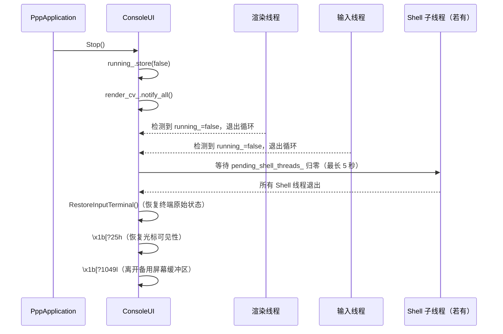

# TUI 设计 — PPP PRIVATE NETWORK™ 2 控制台界面

[English Version](TUI_DESIGN.md)

## 概述

ConsoleUI 子系统（`ppp/app/ConsoleUI.h` / `ppp/app/ConsoleUI.cpp`）实现了一个
单例全屏终端 UI，内部划分为三个可滚动区段（VPN 信息、命令输出、输入行），并通过
专用渲染线程和输入线程运行，不会阻塞 Boost.Asio 主事件循环。

当 stdout 未连接到真实终端（例如输出被重定向到文件或管道）时，TUI 会被完全跳过，
转而以纯文本格式打印启动信息。

---

## 布局

```
┌──────────────────────────────────────────────────────────────────────┐
│ PageUp/PageDown: 滚动命令输入/输出         PPP PRIVATE NETWORK™ 2 │
│ Home/End       : 滚动 openppp2 信息                                  │
│          [彩色 OPENPPP2 ASCII 艺术字，5 行]                          │
├──────────────────────────────────────────────────────────────────────┤
│  [信息区段 — VPN 状态快照，Home / End 滚动]                         │
├──────────────────────────────────────────────────────────────────────┤
│  [命令区段 — 命令历史 / 输出，PageUp / PageDown 滚动]               │
├──────────────────────────────────────────────────────────────────────┤
│  > [输入行或占位提示，白底字符块作为光标]                           │
├──────────────────────────────────────────────────────────────────────┤
│  [WARN] 118 SocketDisconnected: Socket disconnected (5s ago)        │
└──────────────────────────────────────────────────────────────────────┘
```

### 固定行数

| 区段                     | 行数  |
|--------------------------|-------|
| 顶部边框                 | 1     |
| 提示行                   | 2     |
| ASCII 艺术字             | 5     |
| 空行                     | 1     |
| 头部分隔符               | 1     |
| **头部合计**             | **10**|

| 区段                     | 行数  |
|--------------------------|-------|
| 输入分隔符               | 1     |
| 输入行                   | 1     |
| 状态分隔符               | 1     |
| 状态栏                   | 1     |
| 底部边框                 | 1     |
| **底部合计**             | **5** |

### 动态分配

```
middle = terminal_height - 10 - 5
info_height = max(2,  (middle - 1) * 3 / 5)
cmd_height  = max(1,  middle - 1 - info_height)   // -1 是信息/命令分隔符
```

最小支持的终端尺寸：**40 × 20**。

---

## 线程模型

TUI 使用两个专用线程，完全不阻塞 Boost.Asio IO 线程：



---

## 盒线字符编码

所有边框字符以 UTF-8 3 字节序列编码。每个字符在兼容终端上精确占用 **一个显示列**。

| 符号 | Unicode | UTF-8 字节       |
|------|---------|------------------|
| `┌`  | U+250C  | E2 94 8C         |
| `┐`  | U+2510  | E2 94 90         |
| `└`  | U+2514  | E2 94 94         |
| `┘`  | U+2518  | E2 94 98         |
| `├`  | U+251C  | E2 94 9C         |
| `┤`  | U+2524  | E2 94 A4         |
| `┬`  | U+252C  | E2 94 AC         |
| `┴`  | U+2534  | E2 94 B4         |
| `─`  | U+2500  | E2 94 80         |
| `│`  | U+2502  | E2 94 82         |

---

## ASCII 艺术字着色

"OPENPPP2" 的五行艺术字在显示列 **24** 处分割：

- 列 `[0, 24)` → 深灰色 ANSI `\x1b[90m`（代表 **OPEN**）
- 列 `[24, end)` → 粗体亮白色 ANSI `\x1b[1;97m`（代表 **PPP2**）

颜色仅在 `vt_enabled_` 为 true（当前控制台句柄已确认 VT100 处理）时应用。

---

## 按键绑定

| 按键                 | 作用 |
|----------------------|------|
| `Home`               | 将信息区段滚动到顶部（最旧内容） |
| `End`                | 将信息区段滚动到底部（最新内容） |
| `PageUp`             | 命令区段向上滚动（向旧内容方向） |
| `PageDown`           | 命令区段向下滚动（向最新内容方向） |
| `↑`                  | 从历史记录中调出上一条命令 |
| `↓`                  | 调出下一条命令 / 恢复当前输入 |
| `←`                  | 文本光标左移 |
| `→`                  | 文本光标右移 |
| `Ctrl+A`             | 光标移至行首 |
| `Ctrl+E`             | 光标移至行尾 |
| `Backspace`          | 删除光标前的字符 |
| `Delete`             | 删除光标处的字符 |
| `Enter`              | 执行命令 |

---

## 内置命令

| 命令                  | 动作 |
|-----------------------|------|
| `openppp2 help`       | 向命令输出区段打印命令列表 |
| `openppp2 restart`    | 通过 `ShutdownApplication(true)` 优雅重启 |
| `openppp2 reload`     | 与 restart 相同行为 |
| `openppp2 exit`       | 通过 `ShutdownApplication(false)` 退出 |
| `openppp2 info`       | 拉取并打印完整运行时环境快照 |
| `openppp2 clear`      | 清空命令输出环形缓冲区 |
| `openppp2 telemetry status` | 打印当前遥测配置状态 |
| `openppp2 telemetry help`   | 打印遥测子命令用法 |
| `openppp2 telemetry log on\|off\|toggle`     | 遥测日志控制台/本地输出过滤器 |
| `openppp2 telemetry metric on\|off\|toggle`  | 指标控制台/本地输出过滤器 |
| `openppp2 telemetry span on\|off\|toggle`    | span 控制台/本地输出过滤器 |
| `openppp2 telemetry level 0\|1\|2\|3`        | 设置遥测 verbosity 阈值（0=仅 Info … 3=全部） |
| `openppp2 telemetry all`     | 启用所有控制台遥测过滤器 |
| `openppp2 telemetry quiet`   | 禁用所有控制台遥测过滤器 |
| `openppp2 telemetry clear`   | 清空遥测事件缓冲区 |
| *(其他任意输入)*      | 作为 shell 命令执行，捕获输出 |

`help`、`restart`、`exit`、`clear`、`status` 等裸命令不会映射为内置命令，会按 shell 命令执行。

### 遥测控制命令

> **迁移说明：** 旧版本通过单字符热键（`l`、`m`、`s`、`0`–`3`、`a`、`q`、`?`）控制遥测功能，
> 按键后立即生效。这些热键已被**移除**，因为它们会干扰正常的 shell 输入 —— 例如在 shell 命令中
> 输入 `l` 时可能意外切换遥测日志。
>
> 遥测现在完全通过 `openppp2 telemetry …` 命令命名空间控制。TUI 仅在按下 `Enter` 后才解析遥测
> 命令，将整行输入视为完整命令。这消除了旧热键模型的输入截获和截断问题。

| 命令 | 等效说明 |
|------|----------|
| `openppp2 telemetry` | 等同于 `openppp2 telemetry status` |
| `openppp2 telemetry status` | 打印日志、指标、span 的当前过滤器状态及 verbosity 阈值 |
| `openppp2 telemetry help` | 打印完整的遥测子命令参考 |
| `openppp2 telemetry log on` | 启用遥测日志控制台/本地输出过滤器 |
| `openppp2 telemetry log off` | 禁用遥测日志控制台/本地输出过滤器 |
| `openppp2 telemetry log toggle` | 切换遥测日志控制台/本地输出过滤器 |
| `openppp2 telemetry metric on` | 启用指标控制台/本地输出过滤器 |
| `openppp2 telemetry metric off` | 禁用指标控制台/本地输出过滤器 |
| `openppp2 telemetry metric toggle` | 切换指标控制台/本地输出过滤器 |
| `openppp2 telemetry span on` | 启用 span 控制台/本地输出过滤器 |
| `openppp2 telemetry span off` | 禁用 span 控制台/本地输出过滤器 |
| `openppp2 telemetry span toggle` | 切换 span 控制台/本地输出过滤器 |
| `openppp2 telemetry level 0` | 仅 Info（verbosity 阈值 0） |
| `openppp2 telemetry level 1` | Info + Verb（verbosity 阈值 1） |
| `openppp2 telemetry level 2` | Info + Verb + Debug（verbosity 阈值 2） |
| `openppp2 telemetry level 3` | Info + Verb + Debug + Trace（verbosity 阈值 3） |
| `openppp2 telemetry all` | 启用所有控制台遥测过滤器（日志 + 指标 + span） |
| `openppp2 telemetry quiet` | 禁用所有控制台遥测过滤器（日志 + 指标 + span） |
| `openppp2 telemetry clear` | 清空遥测事件缓冲区（TUI 右侧面板） |

`telemetry` 命名空间必须使用 `openppp2` 前缀 —— 裸输入 `telemetry` 会作为 shell 命令执行。

> **注意：** 上述 `log`、`metric`、`span`、`all`、`quiet` 命令仅控制控制台/本地输出过滤器
> （对应 `SetConsoleLogEnabled`、`SetConsoleMetricEnabled`、`SetConsoleSpanEnabled`），
> 不会改变 `telemetry.enabled` 配置或运行期全局开关。`level` 命令设置的是 verbosity 阈值，不涉及 severity 过滤。

### 系统命令执行

非内置命令在**受追踪的 std::thread** 中执行，避免阻塞输入循环：

- **Windows**：`cmd /c <command> 2>&1`
- **Linux / macOS**：`<command> 2>&1`

子进程的输出行通过 `AppendLine()` 逐行追加到 `cmd_lines_`。

线程生命周期由 `pending_shell_threads_`（`std::atomic<int>`）计数追踪：线程启动前递增，退出时递减并调用 `render_cv_.notify_one()`。`Stop()` 对计数器归零执行有界等待（最长 5 秒），防止 ConsoleUI 实例销毁后的 use-after-free。

---

## 刷新策略（无闪烁）

渲染管线围绕三条原则设计：**不在每一帧开关光标**、**不在每一帧清屏**、**按需重绘**（脏标记驱动）。

```
RenderLoop（condition_variable 节拍，最长 100 ms）
  ├─ render_cv_.wait_for(lock, 100ms)
  ├─ DrainStatusQueue()  — 短锁 swap 出队列，锁外处理，再短锁写回
  ├─ need_redraw = dirty_.exchange(false) || force_redraw_
  ├─ 若终端尺寸变化，force_redraw_ = true; need_redraw = true
  ├─ 若 need_redraw，则 RenderFrame()
  └─ （循环 — 由 MarkDirty() 立即唤醒，或最多等待 100 ms）
```

所有公共修改方法（`AppendLine`、`UpdateStatus`、`SetInfoLines`、全部 `Insert*` / `Move*` / `Erase*` / `Scroll*`、以及 `HandleEnter`）在释放锁之后调用 `MarkDirty()`。`MarkDirty()` 同时调用 `render_cv_.notify_one()`，渲染线程在 UI 状态变化后**微秒级**唤醒，而非固定 20 Hz 节拍。



`DrainStatusQueue()` 采用两阶段锁模式：短暂持锁将队列 `swap` 到本地变量，释放锁后在锁外执行字符串处理（`ToLower`、`find`、`substr` 等），最后再次短暂持锁写回 `vpn_state_text_` 和 `speed_text_`。

### 光标处理（无闪烁）

**真实终端光标在 TUI 会话的全生命周期内始终隐藏**，只有 `Stop()` 在退出时才会将其恢复可见。输入行中的插入位置通过一个白色背景字符块来指示，该字符块由 `BuildEditorLine()` 按字节位置嵌入：

```
> Editor text with caret█here
             ^^^^^^^^^^^
             渲染为 "\x1b[47m h\x1b[0m"（白色背景的 'h'）
```

由于该字符块是渲染字符串的一部分，它与帧中的其他字符一起原子更新，永远不会产生循环发送 `\x1b[?25h` / `\x1b[?25l` 导致的光标抖动。

### 最小清屏策略

| 条件                                 | 发送的转义序列 |
|--------------------------------------|------------------|
| `Start()` 之后的第一帧               | `\x1b[2J\x1b[H`（整屏清除 + 归位） |
| 终端尺寸发生变化                     | `\x1b[2J\x1b[H`（整屏清除 + 归位） |
| 其他所有帧                           | `\x1b[H`（仅光标归位）             |

由于每一行输出都会被 box 构建器右填充为精确的 `width` 列宽度，仅用"光标归位 + 全高度覆盖"即可擦除上一帧的内容，避免了 `\x1b[2J` 带来的屏幕闪烁。

### 备用屏幕缓冲区

`Start()` 通过 `\x1b[?1049h` 进入终端的备用屏幕缓冲区，`Stop()` 通过 `\x1b[?1049l` 离开。备用缓冲区的内容由终端模拟器保存，TUI 退出后用户原有的 shell 提示符、滚动历史、光标位置会**原样再现**。

Windows 平台上还会在 `Start()` 时额外快照以下状态并在 `Stop()` 恢复：

- `GetConsoleMode()` — 控制台输出模式标志
- `GetConsoleCursorInfo()` — 光标可见性

---

## 无 TTY 降级

```
ConsoleUI::ShouldEnable()
  ├─ Windows：_isatty(_fileno(stdout))
  └─ POSIX：  isatty(STDOUT_FILENO)
```

当 `ShouldEnable()` 返回 `false` 时：

1. **不**启动 `ConsoleUI`。
2. `PppApplication::Main()` 向 stdout 打印一次性纯文本 banner：
   - 应用版本
   - 模式（client / server）
   - 进程 ID
   - 配置文件路径
   - 工作目录
3. 进程正常提供完整的 VPN 功能。
4. 无渲染线程，无输入线程。



这确保了 `./ppp > log.txt` 或管道输出能正常工作，不受干扰。

如果 `ShouldEnable()` 返回 `true`，但 `ConsoleUI::Start()` 在终端准备或可选线程启动阶段失败，
进程现在也会降级到相同的纯文本路径，并发布告警级诊断 `RuntimeOptionalUiStartFailed`，而不会把可选 UI
初始化失败升级成致命运行时错误。

---

## 线程安全

所有可变 ConsoleUI 状态由单个 `std::mutex lock_` 保护。渲染线程和输入线程都在短暂的临界区（快照拷贝）内持锁，然后对本地副本进行操作。

`running_` 是 `std::atomic<bool>`，通过 `compare_exchange_strong(memory_order_acq_rel)` 进行无锁线程生命周期信号传递。

`pending_shell_threads_`（`std::atomic<int>`）追踪活跃的 shell 子线程数量。`Stop()` 等待（最长 5 秒）此计数器归零后再销毁共享状态。

`render_cv_`（`std::condition_variable`）由 `MarkDirty()` 和 shell 线程用于无自旋唤醒渲染线程，由独立的 `render_cv_mutex_` 保护（与 `lock_` 分离，避免竞争）。



---

## 数据流



---

## TUI 启动时序



---

## TUI 关闭时序



---

## 平台差异

| 特性                     | Windows                                   | POSIX                              |
|--------------------------|-------------------------------------------|------------------------------------|
| 输入读取                 | `_kbhit` + `_getch`                       | `poll()` + `read(STDIN_FILENO)`     |
| 输入模式                 | `PrepareInputTerminal()` 清除 `ENABLE_ECHO_INPUT` 和 `ENABLE_LINE_INPUT`，`RestoreInputTerminal()` 恢复 | `tcsetattr` 关闭 `ICANON`/`ECHO`/`ISIG` |
| 终端状态保存             | `GetConsoleMode/CursorInfo` + stdin 模式  | `tcgetattr` + `fcntl` 标志         |
| 备用屏幕缓冲区           | `\x1b[?1049h/l`（需启用 VT）             | `\x1b[?1049h/l`                    |
| 虚拟终端启用             | `ENABLE_VIRTUAL_TERMINAL_PROCESSING`      | 默认支持                           |

**滚动边界：** 信息区和命令区的最大滚动偏移均限制为 `max(0, (int)content_lines - panel_height)`，防止过度滚动导致面板顶部出现空行。

---

## ConsoleUI 公共 API

| 方法 | 说明 |
|------|------|
| `static bool ShouldEnable()` | 检测 stdout 是否连接到真实终端 |
| `bool Start()` | 启动 TUI（渲染线程 + 输入线程），返回是否成功 |
| `void Stop()` | 停止 TUI，恢复终端状态，等待所有线程退出 |
| `void AppendLine(string line)` | 向命令输出区追加一行，唤醒渲染 |
| `void SetInfoLines(vector lines)` | 替换信息区全部内容，唤醒渲染 |
| `void UpdateStatus(string status)` | 推送运行时状态文本到内部队列，线程安全 |

### 状态栏语义

底部状态栏分为左右两栏：

- **左栏**：诊断快照 + telemetry filter 指示（`| T:<LMS flags> @<level> (openppp2 telemetry help)`）。
  - 当前错误码为 `ErrorCode::Success` 时显示 `[INFO] 0 Success: Success`。
  - 有错误时显示 `[%LEVEL%] <数值ID> <CodeName>: <message> (<age>)`。
  - ANSI 颜色按严重级别区分：info=绿色、warn=黄色、error=红色、fatal=亮红色。
- **右栏**：VPN 状态与吞吐摘要（如 `VPN: connected  ↑ 1.2MB/s  ↓ 3.4MB/s`）。

两栏通过 `BoxSplitRow()` 一次性渲染，中间有垂直分隔线。

---

## 错误码参考

TUI 子系统相关的错误码（来自 `ppp/diagnostics/ErrorCodes.def`）：

| ErrorCode | 说明 |
|-----------|------|
| `RuntimeEnvironmentInvalid` | 终端输入模式或 VT 初始化失败 |
| `RuntimeThreadStartFailed` | 渲染/输入工作线程启动失败 |

---

## 相关源码

- `ppp/app/ConsoleUI.h` / `ppp/app/ConsoleUI.cpp` — TUI 主实现
- `ppp/app/ApplicationInitialize.cpp` — TUI 启停整合点（isatty 降级判断）
- `ppp/app/ApplicationMainLoop.cpp` — 通过 `UpdateStatus` / `SetInfoLines` 向 TUI 推送数据
- `ppp/stdafx.cpp::HideConsoleCursor` — 跨平台光标可见性原语

---

## 参考

- VT100 / ANSI 转义序列：ECMA-48
- 备用屏幕缓冲区：xterm control sequences，DEC Private Mode 1049
- 最小清屏理念来源：ncurses 的 `wnoutrefresh` + `doupdate` 双缓冲思想
